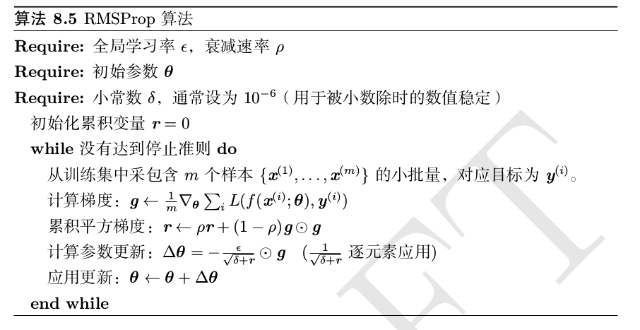

优化是不只是机器学习中一个基础而重要的步骤，对于这种计算机学科乃至理工科，都是

## 一、数值计算与优化基础

### 1.1 溢出

在计算机中，我们通过有限的离散位数来表示无限的连续实数域，这使得这种原因导致的数值误差————即舍入误差，几乎不可能避免。上溢和下溢是一种非常严重的舍入误差。比如机器学习中常见的Softmax函数，其中的除法和指数运算就是经常会出现溢出并导致计算错误的案例，常见的防范措施是对于每个Softmax的$$$w$$$，进行计算$$$w=w-maxw_j$$$。

### 1.2 病态条件

条件数表征函数相对于输入的微小变化而变化的快慢程度。输入被轻微扰动而迅速改变的函数对于数值计算来说可能是有问题的，因为输入中的舍入误差可能导致输出的巨大变化。
考虑函数 $$$f(x)=A^{-1}x$$$ ，当$$$A$$$可以特征值分解时，其条件数为：

$$max_{i,j} \bigg| \frac{\lambda_i}{\lambda_j}\bigg|$$

当该定义下的条件数很大时，矩阵求逆对于输入的误差特别敏感。对于病态条件对于计算的不稳定性，我们可以做一个小实验。可以看到的确是条件数越大，对于输入越不稳定。

```python
import numpy as np
from numpy import linalg
m = np.random.random(size=(3,3))

def f(m, delta):
    x1 = np.array([1,1,1])
    x2 = x1 + delta
    print("{}扰动误差".format(delta), linalg.norm(np.dot(x1, m) - np.dot(x2, m)))

print("条件数", linalg.cond(m))
f(m, 0.01)
f(m, 0.001)

ill_m = m.copy()
ill_m[0,0] += 100
print("条件数", linalg.cond(ill_m))
f(ill_m, 0.01)
f(ill_m, 0.001)
```
对于 Hessian 矩阵，它的条件数衡量了这些二阶导数的变化范围当 Hessian 的条件数很差时，梯度下降法也会表现得很差。这是因为一个方向上的导数增加得很快,而在另一个方向上增加得很慢,可是梯度下降却不知道导数的这种变化，所以它不知道应该优先探索导数长期为负的方向，而不是梯度当前最小但是却会快速增加的方向。病态条件也导致很难选择合适的步长。步长必须足够小,以免冲过最小而向具有较强正曲率的方向上升。这通常意味着步长太小,以致于在其他较小曲率的方向上进展不明显。

在上图中，就是经典的GD算法表现不好的“峡谷场景”，如果可以利用Hessian矩阵，我们会得到$$$g^THg$$$是一个较大的正数，这意味着一阶拟合的效果很不好，二阶项告诉我们在当前方向上函数要比一阶项预测的大，所以Hessian可以告诉我们当前方向不是最好的方向。

### 1.3 基于梯度的优化方法
对于一个标量函数函数，函数的导数告诉我们的信息是输入的小变化怎么影响输出的变化，实际上这来自于泰勒分解的第一项，即只使用线性项与拟合原函数的结果，所以倒数告诉了我们**斜率**信息。
在导数为零的地方，我们无法通过线性项获得函数的斜率信息，这实际上是一种一阶的**退化现象**。此时的 x 被称为临界点(Critical Point)或者驻点(Stationary Point)。
对于接受向量输入的函数，导数的概念被扩展为偏导数、梯度和方向导数。偏导数是针对一维数据的导数，梯度是偏导数构成的向量。方向导数是f在 **u** 方向的斜率。方向导数是函数 $$$f(x+αu)$$$ 关于 α 的导数(在 α = 0 时取得)。使用链式法则,我们可以看到当 α = 0 时, $$$\frac{∂}{∂α}f(x + αu) = u^⊤∇f(x)$$$。通过这个式子，我们以希望找到一个方向，该方向上的方向导数最小，该方向即为负梯度方向，使用该方向的一阶方法称为最速下降法。

### 1.4 Jocobian和Hessian矩阵
对于输入和输出均为导数的函数，其偏导数为矩阵，被称为**Jacobian**矩阵。这个矩阵在我们进行积分的计算使用变量替换时会经常用到。

另外，导数的导数对于多维函数变现为Hessian矩阵，根据概念，他等价于梯度函数的 Jocobian 矩阵。它表示只基于梯度信息的梯度下降步骤是否会产生如我们预期的那样大的改善，因此可以认为它是**曲率的衡量**。Hessian 矩阵是对称的，因此**一定可以将其分解为一组实特征值和一组特征向量的正交基**。

在特定方向 d 上的二阶导数可以写成 $$$d^THd$$$。对于任意的方向 d,方向二阶导数都可以表示为所有特征值的加权平均，**权重在 0 和 1 之间**，且与 d 夹角越小的特征向量的权重越大。最大特征值确定最大二阶导数,最小特征值确定最小二阶导数。

就像前面说的，可以通过二阶导数来预测梯度下降步骤能表现的有多好。

$$f(x) = f(x^{(0)})+(x-x^{(0)})^Tg + \frac12(x-x^{(0)})^TH(x-x^{(0)})$$

当使用最速下降法时，下一步移动的方向是$$$-g$$$， 步长是$$$\epsilon$$$。此时：

$$f(x) = f(x^{(0)}) - \epsilon g^Tg + \frac12g^THg$$

如果想要求出最优步长，实际上对于右侧的二阶逼近来说，就是一个关于步长的二次函数，当$$$\frac12g^THg$$$为负数或者零时，步长在无穷远处时函数值最小，这显然是不行的，因为泰格展开只在邻域内有效；如果二阶项是正数，那可以直接求解最优步长：$$$\frac{g^Tg}{g^THg}$$$。目标函数能用二次函数很好的近似的情况下，Hessian的特征值决定了学习率的量级。

通过Hessian的特征值正负情况，可以判断驻点是极点还是鞍点。在特征值有正有负的情况下，意味着当前点是某个方向上的极大值而是另一个方向上的极小值，这就足以判断该点是一个鞍点。

### 1.5 二阶方法
如果利用起二阶信息比如指导搜索，可以有更快的搜索速度，最简单的就是牛顿法，牛顿法基于二阶的泰勒展开。牛顿法能够以一个二次曲面逼近局部函数。但是牛顿法的一个缺点是会被鞍点吸引，这一点对于梯度下降来说却不是问题。然而在实际使用中由于这一点限制，二阶方法在深度学习中应用却并不广泛，反而一阶方法的优化和变体却是遍地开花。因为深度学习中涉及到的函数族特别复杂，使用二阶方法可能没有保证。通常认为深度学习有非常弱的限制比如**Lipschitz连续**。

### 1.6 约束优化
对于约束优化中的约束有时候不是问题自身限制的，有的时候也可能是我们人为加入的一些约束，比如1-norm正则或者2-norm正则都等价于约束优化问题。对于约束优化问题，KKT（Karush – Kuhn – Tucker）是一个通用性的解法，满足KKt条件时，原问题可以等价的转换为对偶问题。KKT条件，包括：
1. 广义Lagrangian的梯度为零
2. 所有对于x和KKT乘子的条件也都满足。
3. 不等式约束显式的“松弛互补性”。

比如对于最小二乘问题，我们有闭式解。如果我们加上约束，希望$$$x^Tx\le1$$$，那么就需要用到KKT方法了。首先构造广义Lagrangian：
$$L(x,\lambda)=\frac12||Ax-b||^2+\lambda(x^Tx-1)$$

原问题转化为对偶问题$$$minf(x)=max_\lambda min_xL(x)$$$，内层x有闭式解$$$x=(A^TAx+2\lambda I)^-1A^Tb$$$，带入后函数中只有$$$\lambda$$$变量，用梯度上升法求$$$\lambda$$$的最大值。具体说明，当x不满足约束时，拉格朗日函数关于$$$\lambda$$$的梯度是正的，针对$$$\lambda$$$进行梯度上升后，$$$\lambda$$$变大，重新计算x的闭式解，x的范数会减小，重复此过程直到x满足要求切$$$\lambda$$$的梯度是0。


## 二、深度学习中的优化
首先我们了解统计学习的基础是模型，目标函数和算法，模型确定了我们的**假设集 (hypothesis set) **，目标函数告诉我们我们假设集中哪一个假设更好，而学习算法帮助我们找到最好的那一个假设。但是注意，对于一个**学习 (Learning) **任务来说，**优化 (Optimization)** 不是全部，优化只能帮助我们经验风险最小，但是一个学习任务最终的目标是**泛化(generalization)**能力最好。


### 2.1 学习与纯优化的区别
1. 我们使用某种性能度量指标 P 作为我们真正关注的目标，但是学习中使用的是建立在经验分布上的损失函数。比如说我们关注期望泛化误差（risk），但是却优化经验风险，这种学习策略有过拟合的风险，比如高容量的模型可以简单地记住训练集。而且假设我们使用0-1损失，我们甚至没有方法去优化经验损失函数。
2. 我们使用一些其他的损失函数作为0-1损失的代理，比如对数损失。在某些情况下，代理损失函数甚至比原函数能学到更多的东西，在训练集上损失函数为0后继续训练，测试集上0-1损失还能继续下降一段时间，只是因为，我们能持续优化决策边界，加大类别之间的距离以增强模型的鲁棒性。	
3. 如果使用基于测试集的提前终止的话，学习算法甚至不会停在局部最优点上。
4. 实践中使用随机或者小批量算法代替原有的批量算法，原因是考虑n个样本均值的标准差$$$\sigma/\sqrt n$$$，这意味着使用更多样本来估计梯度的方法的回报是低于线性的，另外一个动机是训练及数据的冗余，即大量的样本杜宇梯度的贡献都是近似的。小批量算法一个额外的好处是，他们在学习中可能引入了一些噪声使得自带一些正则化效果，这个之后会详细说明。

### 2.2 神经网络优化中的挑战

#### 2.2.1 病态
Hessian矩阵的病态性之前也提到，这里再次进行详细说明，Hessian如果条件数很大，即使不考虑误差，这样的Hessian矩阵也意味着梯度下降会卡在峡谷区域。为了解决这个问题，我们分别检测代价函数泰勒展开的一阶项 $$$\epsilon g^Tg$$$ 和二阶项 $$$\frac12\epsilon^2g^THg$$$ 。当二阶项超过一阶项的时候，意味着可能会出现问题，因为目标函数可能不降反增。很多情况下，梯度的范数不会显著缩小，但是 $$$g^THg$$$ 的增长会超过一个量级。其结果是尽管梯度很强,学习会变得非常缓慢,因为学习率必须收缩以弥补更强的曲率。


#### 2.2.2 局部极小
对于深度学习，我们会说模型的函数是非凸函数，可能存在局部极小的问题。这个问题是这样的，对于深度学习，一定存在局部极小值，因为**模型的可辨识性问题**，我们简单的交换隐层变量可以得到一个完全一样的模型，这种不可辨识性称为**权重空间对称性**，这意味着我们的特征变化函数其实具有高度的**高维对称结构**。

但是这种局部极小不是困扰我们的问题，因为这些局部极小具有一样的函数值。而且对于超高维空间来说，局部极小意味着Hessian正定，这通常非常困难，我们即使找到梯度为零的点，也基本上是遇到了鞍点。但是每一个特征值为正的概率不是固定的，当我们的损失函数值越小的时候，我们的Hessian中约有较大的可能有正的特征值。


而且一些Paper在某些方向上对随时函数进行可视化，比如初始点和最终点连接的方向上，发现损失函数在这些方向上性质很好，通常是表现为凸的。	

[](http://www.offconvex.org/2016/03/22/saddlepoints/)

#### 2.2.3 长期依赖和梯度爆炸（消失）
梯度消失使得我们难以知道参数朝哪个方向移动能够改进代价函数,而梯度爆炸会使得学习不稳定。这个不用多说了，可以使用截断法解决。


## 三、具体算法

### 3.1 基本算法

#### 3.1.1 SGD


#### 3.1.2 Momentum

动量方法 (Polyak, 1964) 旨在加速学习,特别是处理高曲率、小但一致的梯度,或是带噪声的梯度。动量算法积累了之前梯度指数级衰减的移动平均,并且继续沿该方向移动。


#### 3.1.3 Nesterov


在凸批量梯度的情况下，Nesterov动量将额外误差收敛率降低到$$$O(1/k^2)$$$，可惜在随机梯度下，该算法没有明显改进收敛率。

### 3.2 自适应学习率

#### 3.2.1 Adagrad
独立地适应所有模型参数的学习率,缩放每个参数反比于其所有梯度历史平方值总和的平方根 (Duchi et al., 2011)。具有损失最大偏导的参数相应地有一个快速下降的学习率,而具有小偏导的参数在学习率上有相对较小的下降。净效果是在参数空间中更为平缓的倾斜方向会取得更大的进步。


#### 3.2.2 RMSProp
RMSProp修改Adagrad以在非凸条件下效果更好，改变梯度累计为指数加权移动平均。因此相比于后者，RMSProp引入一个新的超参数控制指数加权移动平均的窗口大小。
当应用于非凸函数训练神经网络时,学习轨迹可能穿过了很多不同的结构,最终到达一个局部是凸碗的区域。AdaGrad 根据平方梯度的整个历史收缩学习率,可能使得学习率在达到这样的凸结构前就变得太小了。RMSProp 使用指数衰减平均以丢弃遥远过去的历史,使其能够在找到凸碗状结构后快速收敛，最终结果就像一个初始化于该碗附近的AdaGrad算法。




#### 3.2.3 Adam


## 参考
1. [如何选择优化器](http://www.jianshu.com/p/d99b83f4c1a6)
2. [当我们在谈论数据挖掘](https://zhuanlan.zhihu.com/data-miner)
3. [“斗大的熊猫”的博客](http://blog.topspeedsnail.com/)
4. [莫烦小哥的blog](https://morvanzhou.github.io/)
5. [DeepLearning](http://homepages.math.uic.edu/~julius/
saddle.html)
6. 