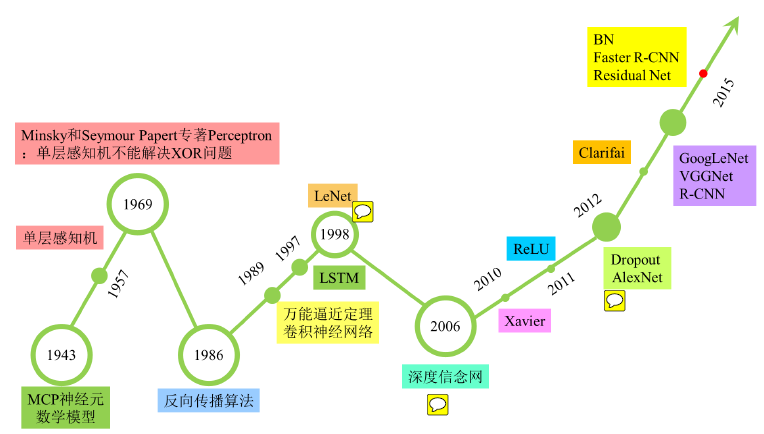

- 1943年：沃伦·麦卡洛克(Warren McCulloch)和沃尔特·皮兹(Walter Pitts)模拟人类大脑神经元提出McCulloch-Pitts Neuron结构。（此时没有学习算法）
- 1958年Rosenblatt发明的感知器（perceptron）算法。
- 1969年，美国数学家及人工智能先驱Minsky在其著作中证明了感知器本质上是一种线性模型，只能处理线性分类问题，就连最简单的XOR（亦或）问题都无法正确分类。这等于直接宣判了感知器的死刑，神经网络的研究也陷入了近20年的停滞。
- 1986年：大牛Hinton第一次打破非线性诅咒，发明了适用于多层感知器（MLP）的BP算法，并采用Sigmoid进行非线性映射，有效解决了非线性分类和学习的问题。该方法引起了神经网络的第二次热潮。第二波神经网络热潮中提出了Distributed Representation。
- 1989年：Robert Hecht-Nielsen证明了MLP的万能逼近定理，即对于任何闭区间内的一个连续函数f，都可以用含有一个隐含层的BP网络来逼近该定理的发现极大的鼓舞了神经网络的研究人员。
- 1989年：LeCun发明了卷积神经网络-LeNet，并将其用于数字识别，且取得了较好的成绩，不过当时并没有引起足够的注意。
- 1991年：Sepp Hochreiter和Juergen Schmidhuber提出LSTM模型。
- 1997年：IBM的Deep Blue打败国际象棋冠军卡斯帕罗斯。
- 2015年：11月9日，Google开源Tensorflow计算框架。