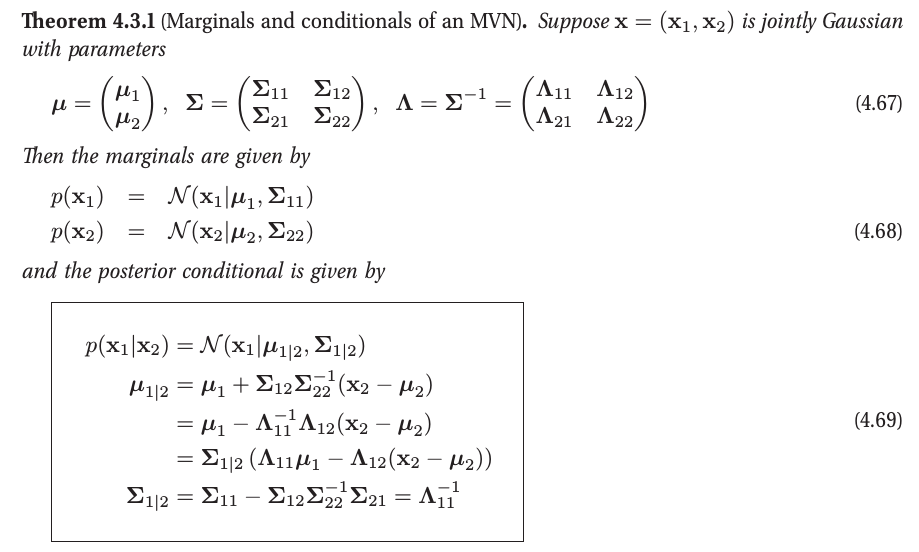

我们的方法将基于高斯过程或GPs。GP定义了先验函数，当我们看到一些数据时，它可以转换为后验函数。虽然表示函数上的分布看起来很困难，但我们只需要在有限但任意的一组点上定义函数值上的分布，比如x1……,xN。

关键思想是，如果kernel认为xi和xj是相似的，那么我们期望函数在这些点上的输出也是相似的。

结果是，在回归场景中，所有这些计算都可以有closed form，时间复杂度是O（N3）。在分类场景中，我们必须使用近似，例如高斯近似，因为后验不再是完全高斯的。

GPs可以看作是我们在第14章讨论的内核方法的贝叶斯替代方法，包括L1VM、RVM和SVM。虽然这些方法比较稀疏，因此速度更快，但它们没有提供经过良好校准的概率输出(请参阅15.4.4小节进行进一步讨论)。在某些应用程序中，适当调整概率输出是很重要的，例如在线视觉和机器人跟踪(Ko和Fox 2009)，强化学习和最佳控制(Engel等，2005;非凸函数的全局优化(Mockus et al. 1996;Lizotte 2008;Brochu等人，实验设计(Santner等人，2003)等。

注意，通常使用m(x) = 0的均值函数，因为GP足够灵活，可以任意建模均值，如下所示。然而，在15.2.6节中，我们将考虑均值函数的参数模型，因此GP只需对残差进行建模。这种半参数方法结合了参数模型的可解释性和非参数模型的准确性。

**Predictions using noise-free observations**

如果我们让GP预测f (x)它已经看到的x值，我们希望GP返回没有不确定性的答案f (x)换句话说，它应该充当训练数据的插值器。只有当我们假设观测是无噪声的，这才会发生。下面我们将考虑噪声观测的情况。

**Inference in jointly Gaussian distributions**

给定一个联合分布p(x1, x2)，能够计算边线p(x1)和条件p(x1 |x2)是很有用的。我们在下面讨论如何做到这一点，然后给出一些应用。在最坏的情况下，这些操作需要O(d3)时间。有关更快的方法，请参阅第20.4.3节。

[条件高斯分布](https://seanwangjs.github.io/2018/01/08/conditional-gaussian-distribution.html)

边缘分布和条件分布本身都是高斯分布。对于边缘分布，我们只提取对应于x1或x2的行和列。对于条件条件，我们需要做更多的工作。然而，这并不复杂:条件均值只是x2的线性函数，条件协方差只是一个常数矩阵，与x2无关。我们给出了三个不同的(但等价的)后验均值表达式，两个不同的(但等价的)后验协方差表达式;每一个在不同的情况下都是有用的。

https://htmlpreview.github.io/?https://github.com/Kivy-CN/MLAPP-CN/master/HTML/04%20Gaussian%20models.html

在形式上，高斯过程生成的数据分布在整个域内，使得范围的任何有限子集都遵循多元高斯分布。

