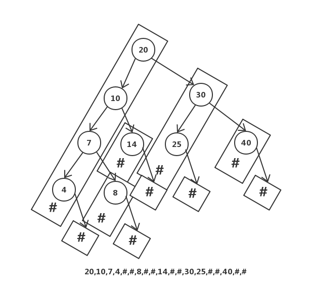

### 682. Baseball Game
没啥。

### 496. Next Greater Element I
使用了MinStack，有点意思的。维护一个MinStack，然后遍历数组，栈空或者当前元素小于栈顶元素时，压栈；大于的话就出栈并且意味着找到了比当前栈顶元素大的第一个值，出栈。

### 232. Implement Queue using Stacks
一个数据栈，一个辅助栈，用于捣腾数据。

### 20. Valid Parentheses
乍一看没啥，其实也没啥，但是要注意特殊情况。比如最后stack最后没有全部出栈，或者stack为空时需要出栈，不要只考虑每次来一个元素我看匹不匹配这种常规情况。

### 856. Score of Parentheses （bangbang）
基本没啥。但是这道题有几个额外的思路不错，Solution中给出了基于“Count Cores”的思路，大致意思就是每个基本的分数都是泪子与一个相邻的“()”，然后每个相邻的左右括号外面被包了多少层就要乘以几个2，这个思路也非常棒，并且不需要额外的空间，但是能想到这一点需要对题目本质的清晰认知。

### 155. Min Stack
应该是出现次数比较频繁的一道题了。常规做法的需要一个辅助栈，大小与数据栈一致，但是实际上没有必要存一些重复的最小值。比如压栈顺序是1,2,3,4,5,6，那么辅助栈里面只存放1就行，这里可以优化。这种情况面对1,1,1,1,1,1的压栈顺序，依然会存放多个1，如果让辅助栈只保存最小值的索引位置，那么又可以优化。此时的辅助栈其实是一个索引最小栈，里面的索引到的值是严格单调递减的。思路来自于[如何实现获取最小值的栈](https://blog.csdn.net/weixin_42124622/article/details/82414427)

### 225. Implement Stack using Queues
没啥

### 739. Daily Temperatures
> 索引单调栈

又是一个单调栈的问题，而且要是索引单调栈，这部分需要整理一下。

### 94. Binary Tree Inorder Traversal *（bangbang）*
不用递归遍历树，常规操作，还是注意一下吧。

### 144. Binary Tree Preorder Traversal
同上

### 103. Binary Tree Zigzag Level Order Traversal
层次遍历的变体，层次遍历是用queue，这里用stack，就不用一个指向当前层的指针了，用那个是因为可以简化代码，不过这里为了满足zigzag顺序，需要一层先处理左孩子，另一层先处理右孩子。

### 394. Decode String
没啥，考虑的全面一些就行。

### 173. Binary Search Tree Iterator
挺好的，不过就不加bangbang标签了。实际上是实现了一个迭代器协议，内部用栈保存状态，本质这道题考的是先序遍历二叉树。

### 331. Verify Preorder Seriaization of a Binary Tree *(bangbang)*

类似于上图展示了我的思路，也展示了对于先序遍历树的时候，栈的构造，对酒对于有左孩子时，压左孩子压到底，然后遇到一个出栈，然后变右孩子，重复上述过程。这道题解决的时候就是对出栈次数计数，对于先序遍历的话每出栈两次就要有一次额外的出栈。比如开始时，遇到两个pop#后，4就要也出栈，然后又遇到两个pop#后，8也要被pop，此时7也要被pop，这个就好像是两个瓶盖能兑换一瓶饮料时，用4瓶饮料的钱可以喝7瓶的道理是一样的。这个原理在不用栈的先序遍历二叉树时是怎么体现的呢？就是想要想要访问某一个元素时的又节点时，该元素必须先被pop那两行代码那里。

### 907. Sum of Subarray Minimums *(bangbang)*
> 单调栈
这道题还有点难度，需要利用单调栈获得向左向右的最远延伸距离。
假设输入是[3,2,1,4]，对于元素1来说，它的索引是2，向左延伸到位置0，向右延伸到元素3，这意味着所有在[0,3]范围内包括了元素1的连续子串的最小值都是1，这个范围内有多少个符合要求的字串呢？1向左有3个，1向右有2个，左右可以任意组合，因此一共有6个符合条件的子串。
另外需要考虑的问题就是出现重复元素。假设输入是：[3,1,2,4,1,5]，那么有两个1，二者不能互相覆盖，比如说[1,2,4,1,5]这个子串只能被计算一遍，要么归属于左边的1要么归属于右边的1，这儿的处理办法就是。left和right用不同的方式计算，left中存的是“向左延伸的最远距离，使得延伸的范围内严格小于当前元素”，right中存的是“向右延伸的最远距离，使得延伸的范围内的元素小于等于当前元素”。这样的话，left数组就是[0,0,2,3,2,5]，right数组就是[0,5,3,3,5,5]所以左边的1的延伸范围是0～5，右边的1的延伸范围是2～5，这样如果同时包含了两个1的子数组会被左边的1负责，比如范围是1～4的[1,2,4,1]。
