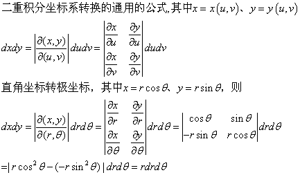

## 均匀采样
在采样技术中，在$$$[0, 1)$$$区间内进行均匀采样可以说是采样算法的基石，比如说逆变换采样就是针对CDF函数的值域上进行采样，对离散分布的轮盘赌算法同理是一种离散分布的逆变换采样，拒绝采样中判断对于一个采样是否被接受需要均匀采样，等等等等，不一而足。而均匀采样底层可能是基于真随机源，也可能是基于某种伪随机数生成器的。

常见的伪随机数生成器通常是采用线性同余法，比如gcc中的glibc版本，对于python3，是使用os内置包中的`urandom`返回随机比特转换为浮点数。

```python
# Lib/random.py
def random(self):
    """Get the next random number in the range [0.0, 1.0)."""
    return (int.from_bytes(_urandom(7), 'big') >> 3) * RECIP_BPF
```

其中`urandom`返回7byte的随机字节，`RECIP_BPF`的值是$$$\frac{1}{2^{53}}$$$，所以该函数返回一个小数点后有56位的二进制浮点数。

## 高斯采样

对于高斯分布，可以使用逆变换采样，但是高斯分布的CDF函数不容易表示，所以，一种常用的数学技巧就是使用二维高斯分布转换为极坐标表示，通常可以得到好的形式。由于正态分布的性质，我们只关注标准正态分布采样。

$$P(x, y) = P(x)P(y) = \frac{1}{2\pi}e^{-\frac12(x^2+y^2)}$$

作极坐标变换：
$$x=rcos\theta$$
$$y=rsin\theta$$

由于：

所以：
$$dxdy=rdrd\theta$$

求积分后，$$$\theta$$$在几分钟被消掉，r的积分上限成为积分结果的唯一变量：
$$F(R) = 1-e^{-\frac12R^2}$$
R的取值范围是0到正无穷，值域是$$$[0, 1]$$$，该函数其实就是对R的CDF函数，该函数的逆运算容易获得，即：
$$invF(r) = \sqrt{-2ln(1-r)}$$
因为r服从0到1范围内的均匀分布，因此上式等价于：
$$invF(r) = \sqrt{-2ln(r)}$$
此时，对二维高斯分布的笛卡尔坐标系的采样已经被成功转换成了极坐标系中的采样，并且该过程容易计算：
$$x = \sqrt{-2ln(r_1)} * cos(2\pi r_2)$$
$$y = \sqrt{-2ln(r_1)} * sin(2\pi r_2)$$

这种计算方式就是对高斯分布进行采样的Box-Muller算法，python内建的gauss随机数函数就是基于该算法实现的。
```python
def gauss(self, mu, sigma):
    """Gaussian distribution.
    mu is the mean, and sigma is the standard deviation.  This is
    slightly faster than the normalvariate() function.
    Not thread-safe without a lock around calls.
    """

    # When x and y are two variables from [0, 1), uniformly
    # distributed, then
    #
    #    cos(2*pi*x)*sqrt(-2*log(1-y))
    #    sin(2*pi*x)*sqrt(-2*log(1-y))
    #
    # are two *independent* variables with normal distribution
    # (mu = 0, sigma = 1).
    # (Lambert Meertens)
    # (corrected version; bug discovered by Mike Miller, fixed by LM)

    # Multithreading note: When two threads call this function
    # simultaneously, it is possible that they will receive the
    # same return value.  The window is very small though.  To
    # avoid this, you have to use a lock around all calls.  (I
    # didn't want to slow this down in the serial case by using a
    # lock here.)

    random = self.random
    z = self.gauss_next
    self.gauss_next = None
    if z is None:
        x2pi = random() * TWOPI
        g2rad = _sqrt(-2.0 * _log(1.0 - random()))
        z = _cos(x2pi) * g2rad
        self.gauss_next = _sin(x2pi) * g2rad

    return mu + z*sigma
```
下面是我自己基于numpy实现的向量化版本：
```python

```

在Box-Muller算法中涉及到三角函数的计算，这种计算比较复杂，因此一种替代算法×××××使用如下替代：
$$sin(\theta) = x/\sqrt{x^2+y^2} = x/\sqrt{r}$$
$$cos(\theta) = y/\sqrt{x^2+y^2} = y/\sqrt{r}$$

此时计算函数为：
$$x = \sqrt{-2ln(r_1)} * x\_/\sqrt{r}$$
$$y = \sqrt{-2ln(r_1)} * y\_/\sqrt{r}$$

哎嘿？x和y不是要输出的吗？怎么在式子的右端也出现了，注意，这里的$$$x\_$$$和$$$x$$$是两个变量，$$$x\_$$$和$$$y\_$$$是通过均匀分布生成的采样点，他们的作用只是为了替代原有的$$$\theta$$$以及三角函数，注意这样得到的$$$(x\_,y\_)$$$的范围输于一个方形区域，我们需要的是一个圆形区域，所以需要拒绝采样（后面会提到）将$$$x^2+y^2\gt 1$$$的采样点过滤掉。这种算法被称为**Marsaglia polar method**，下面是我基于numpy实现的向量化版本。

```python

```

### 轮盘赌采样

其实就是离散版本的逆变换采样，思路十分简单的，在遗传算法中会用到这个算法，下面是我实现的轮盘赌采样。


```python
from random import random
from bisect import bisect_left
from itertools import accumulate

def roulette_sampling(p:dict, n):
    assert type(p) is dict
    samples = [None] * n
    keys = list(p.keys())
    values = p.values()
    cdf = list(accumulate(values))
    for i in range(n):
        random_p = random()
        index = bisect_left(cdf, random_p)
        samples[i] = keys[index]
    return samples

from collections import Counter
test_p = {'a':0.1, 'b':0.3, 'c':0.6}
print(Counter(roulette_sampling(test_p, 10000)))
```

## 拒绝采样

## 重要性采样

这个采样算法更多的是用于计算期望或者用于逼近积分。

## MCMC
全称是Markov Chain Monte Carlo，即马尔科夫链蒙特卡洛方法。蒙特卡洛方法是一系列随机方法，所谓蒙特卡洛模拟（Monte Carlo simulations），是指一种通过重复生成随机数来估计固定参数的方法。通过生成随机数并对其进行一些计算，蒙特卡洛模拟能够为某一无法直接计算（或者直接计算成本过于高昂）的参数提供近似值。

### Metropolis-Hastings Sampling
```python
import numpy as np
import scipy.special as ss
import matplotlib.pyplot as plt

def beta_s(x, a, b):
    return x**(a-1)*(1-x)**(b-1)
def beta(x, a, b):
    return beta_s(x, a, b)/ss.beta(a, b)

def plot_mcmc(a, b):
    cur = np.random.rand()
    states = [cur]
    for i in range(10**5):
        next, u = np.random.rand(2)
        if u < np.min((beta_s(next, a, b)/beta_s(cur, a, b), 1)):
            states.append(next)
            cur = next
    x = np.arange(0, 1, .01)
    plt.figure(figsize=(10, 5))
    plt.plot(x, beta(x, a, b), lw=2, label='real dist: a={}, b={}'.format(a, b))
    plt.hist(states[-1000:], 25, normed=True, label='simu mcmc: a={}, b={}'.format(a, b))
    plt.show()

if __name__ == '__main__':
    plot_mcmc(0.1, 0.1)
    plot_mcmc(1, 1)
    plot_mcmc(2, 3)

```


## 参考
1. [Box–Muller transform](https://en.wikipedia.org/wiki/Box%E2%80%93Muller_transform)
2. [Marsaglia polar method](https://en.wikipedia.org/wiki/Marsaglia_polar_method)
3. [无需数学知识：快速了解马尔可夫链蒙特卡洛方法](https://baijiahao.baidu.com/s?id=1588750123445231830&wfr=spider&for=pc)
4. [MCMC（Markov Chain Monte Carlo）的理解与实践（Python）](https://blog.csdn.net/lanchunhui/article/details/50452515)