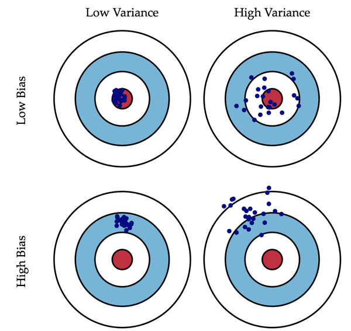
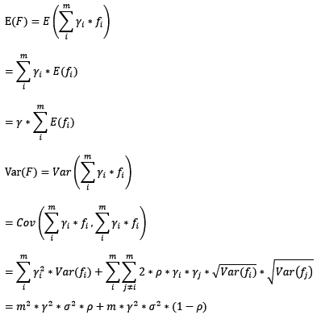
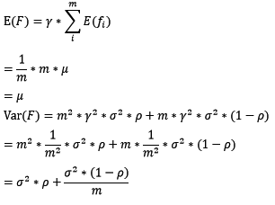
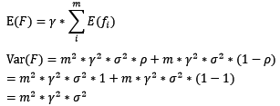
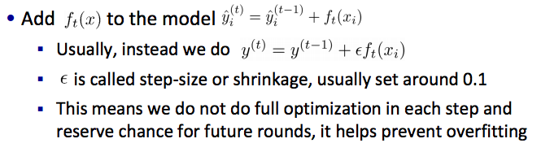

## SVM
1. 支持向量机不提供概率输出,而是对新的输入进行分类决策。
2. 需要特征规格化。
3. 线性可分情况下，最优解可证唯一。《统计学习方法》P100。
4. 间隔长度是w模长的倒数的2倍。
5. 最终的解只依赖支撑向量。
6. 惩罚系数C越大，SVM越倾向于将每个点都分类正确；C越小，SVM泛化能力越强，能容忍更多的错误点。
7. 结构风险最小化来提高泛化能力。
8. 非概率模型

## Perceptron
1. 判别模型，目标是找到一个超平面将特征空间中的点分开，决策函数与SVM相同。是神经网络和SVM的基础
2. 学习策略：假设训练集是线性可分的，学习目标是求得一个能够将训练集正负类完全区分的的分离超平面，为了找的这样的超平面。定义**经验损失函数**并极小化损失函数。
3. 损失函数：直观的选择是误分类点的个数，但是该函数难以优化，所以选择修改该损失为误分类点到超平面的距离和，此时损失函数是超平面参数w和b的连续可导函数。
4. 训练算法：随机梯度下降。（不是使得所有的误分类点梯度下降，而是随机选择一个误分类点使其梯度下降。）
5. 收敛性证明：Novikoff定理。（具体证明略过）当训练数据集线性可分的时候，感知机学习算法是收敛的，感知机算法在训练数据集上的误分类次数k存在上界$$$(\frac{max||x||}{\gamma})^2$$$。
6. 线性可分的数据集上，perceptron存在无数多个解，由于不同的初值或者迭代顺序导致不同。
7. 学习算法的对偶形式
8. 优点：计算和概念都十分简单；因为是随机梯度下降，每次选择一个点，所以是常数的内存消耗，并且可以在线学习（在线学习使得可以扩展至大规模数据）。
9. 缺点：非线性可分数据不能收敛；准确度不够；模型过时。
10. 非概率模型

## KNN
1. 是一种基本的分类与回归方法。k值的选择，距离度量以及分类决策规则是k近邻法的三个要素。
2. KD-Tree

## NB
1. 生成模型

## Decision Tree
1. [CART](cart.jpg)
2. 先剪枝：
- 树到达一定高度
- 节点下包含的样本点小于一定数目
- 信息增益小于一定的阈值等等
- 节点下所有样本都属于同一个类别
3. 后剪枝方法：
- 降低错误剪枝 REP(Reduced Error Pruning)
- 悲观错误剪枝 PEP(Pessimistic Error Pruning)
- 基于错误剪枝 EBP(Error Based Pruning)
- 代价-复杂度剪枝 CCP(Cost Complexity Pruning)
- 最小错误剪枝 MEP(Minimum Error Pruning)
CART用的就是CCP剪枝,其余的剪枝方法可以网上google一下. CCP剪枝类实际上就是我们之前讲到的最小化结构风险。结构风险中的正则项在决策树中是叶节点数目。
4. 决策树缺点：不支持在线学习,有新样本来的时候,需要重建决策树.
5. C4.5支持缺失值处理：
- 赋上该属性最常见的值
- 根据节点的样例上该属性值出现的情况赋一个概率,比如该节点上有10个样本,其中属性A的取值有6个为是,4个为否.那么对改节点上缺失的属性A,以0.6的概率设为是,0.4的概率设为否
- 丢弃有缺失值的样本
6. C4.5支持连续值属性：把需要处理的样本(对应根节点)或样本子集(对应子树)按照连续变量的大小从小到大进行排序.假设该属性对应的不同的属性值一共有N个,那么总共有N−1个可能的候选分割阈值点,每个候选的分割阈值点的值为上述排序后的属性值中两两前后连续元素的中点,根据这个分割点把原来连续的属性一分为二.但实际上可以不用检查所有N−1个分割点,如果相邻两个值对应的类别一样，那就不用尝试该分割点了，当然回归问题就要挨个尝试了。

## LR和最大熵

1. LR与朴素贝叶斯的联系
- 相同点是，它们都能解决分类问题和都是监督学习算法。此外，有意思的是，当假设朴素贝叶斯的条件概率P(X|Y=ck)P(X|Y=ck)服从高斯分布时Gaussian Naive Bayes，它计算出来的P(Y=1|X)P(Y=1|X)形式跟逻辑回归是一样的。
- 不同的地方在于，逻辑回归为判别模型求的是p(y|x)p(y|x)，朴素贝叶斯为生成模型求的是p(x,y)p(x,y)。前者需要迭代优化，后者不需要。在数据量少的情况下后者比前者好，数据量足够的情况下前者比后者好。由于朴素贝叶斯假设了条件概率P(X|Y=ck)P(X|Y=ck)是条件独立的，也就是每个特征权重是独立的，如果数据不符合这个情况，朴素贝叶斯的分类表现就没有逻辑回归好。

2. LR与最大熵模型
逻辑回归跟最大熵模型没有本质区别。逻辑回归是最大熵对应类别为二类时的特殊情况，也就是当逻辑回归类别扩展到多类别时，就是最大熵模型。
- 指数簇分布的最大熵等价于其指数形式的最大似然。
- 二项式分布的最大熵解等价于二项式指数形式(sigmoid)的最大似然；
- 多项式分布的最大熵等价于多项式分布指数形式(softmax)的最大似然。

## RF
1. 在数据集上表现良好，两个随机性的引入，使得随机森林不容易陷入过拟合.
2. 在当前的很多数据集上，相对其他算法有着很大的优势，两个随机性的引入，使得随机森林具有很好的抗噪声能力.
3. 它能够处理很高维度（feature很多）的数据，并且不用做特征选择，对数据集的适应能力强：既能处理离散型数据，也能处理连续型数据，数据集无需规范化
4. 可生成一个 $$$Proximities=(p_{ij})$$$ 矩阵，用于度量样本之间的相似性： $$$p_{ij}=a_{ij}/N$$$, $$$a_{ij}$$$表示样本i和j出现在随机森林中同一个叶子结点的次数，N随机森林中树的颗数
5. 在创建随机森林的时候，对generlization error使用的是无偏估计
6. 训练速度快，可以得到变量重要性排序（两种：基于OOB误分率的增加量和基于分裂时的GINI下降量。另外，为了尽可能增加子模型受随机性扰动的可能性，每棵树要尽可能的生长，也就是没有剪枝过程，这也使得实现很简单。
7. 在训练过程中，能够检测到feature间的互相影响
8. 容易做成并行化方法。
9. 使用带外估计泛化能力。

bias-variance分解

在bagging和boosting框架中，通过计算基模型的期望和方差，我们可以得到模型整体的期望和方差。为了简化模型，我们假设基模型的权重、方差及两两间的相关系数相等。由于bagging和boosting的基模型都是线性组成的，那么有：

对于bagging来说，每个基模型的权重等于1/m且期望近似相等（子训练集都是从原训练集中进行子抽样），故我们可以进一步化简得到：

根据上式我们可以看到，整体模型的期望近似于基模型的期望，这也就意味着整体模型的偏差和基模型的偏差近似。同时，整体模型的方差小于等于基模型的方差（当相关性为1时取等号），随着基模型数（m）的增多，整体模型的方差减少，从而防止过拟合的能力增强，模型的准确度得到提高。但是，模型的准确度一定会无限逼近于1吗？并不一定，当基模型数增加到一定程度时，方差公式第二项的改变对整体方差的作用很小，防止过拟合的能力达到极限，这便是准确度的极限了。另外，在此我们还知道了为什么bagging中的基模型一定要为强模型，否则就会导致整体模型的偏差度低，即准确度低。

Random Forest是典型的基于bagging框架的模型，其在bagging的基础上，进一步降低了模型的方差。Random Fores中基模型是树模型，在树的内部节点分裂过程中，不再是将所有特征，而是随机抽样一部分特征纳入分裂的候选项。这样一来，基模型之间的相关性降低，从而在方差公式中，第一项显著减少，第二项稍微增加，整体方差仍是减少。

对于boosting来说，基模型的训练集抽样是强相关的，那么模型的相关系数近似等于1，故我们也可以针对boosting化简公式为：

通过观察整体方差的表达式，我们容易发现，若基模型不是弱模型，其方差相对较大，这将导致整体模型的方差很大，即无法达到防止过拟合的效果。因此，boosting框架中的基模型必须为弱模型。

因为基模型为弱模型，导致了每个基模型的准确度都不是很高（因为其在训练集上的准确度不高）。随着基模型数的增多，整体模型的期望值增加，更接近真实值，因此，整体模型的准确度提高。但是准确度一定会无限逼近于1吗？仍然并不一定，因为训练过程中准确度的提高的主要功臣是整体模型在训练集上的准确度提高，而随着训练的进行，整体模型的方差变大，导致防止过拟合的能力变弱，最终导致了准确度反而有所下降。

基于boosting框架的Gradient Tree Boosting模型中基模型也为树模型，同Random Forrest，我们也可以对特征进行随机抽样来使基模型间的相关性降低，从而达到减少方差的效果。

## GBDT
**基分类器的选择**：传统GBDT以CART作为基分类器，XGBoost还支持线性分类器，这个时候XGBoost相当于带L1和L2正则化项的逻辑斯蒂回归（分类问题）或者线性回归（回归问题）。

**二阶泰勒展开**：传统GBDT在优化时只用到一阶导数信息，XGBoost则对代价函数进行了二阶泰勒展开，同时用到了一阶和二阶导数。顺便提一下，XGBoost工具支持自定义损失函数，只要函数可一阶和二阶求导。

**方差-方差权衡**：XGBoost在目标函数里加入了正则项，用于控制模型的复杂度。正则项里包含了树的叶子节点个数T、每个叶子节点上输出分数的L2模的平方和。从Bias-variance tradeoff角度来讲，正则项降低了模型的variance，使学习出来的模型更加简单，防止过拟合，这也是XGBoost优于传统GBDT的一个特性。

**Shrinkage（缩减）**：相当于学习速率（xgboost中的ϵ）。XGBoost在进行完一次迭代后，会将叶子节点的权重乘上该系数，主要是为了削弱每棵树的影响，让后面有更大的学习空间。实际应用中，一般把eta设置得小一点，然后迭代次数设置得大一点。（补充：传统GBDT的实现也有学习速率）

**列抽样（column subsampling）**：XGBoost借鉴了随机森林的做法，支持列抽样，不仅能降低过拟合，还能减少计算，这也是XGBoost异于传统GBDT的一个特性。
缺失值处理：XGBoost考虑了训练数据为稀疏值的情况，可以为缺失值或者指定的值指定分支的默认方向，这能大大提升算法的效率，paper提到50倍。即对于特征的值有缺失的样本，XGBoost可以自动学习出它的分裂方向。
**XGBoost工具支持并行**：Boosting不是一种串行的结构吗?怎么并行的？注意XGBoost的并行不是tree粒度的并行，XGBoost也是一次迭代完才能进行下一次迭代的（第t次迭代的损失函数里包含了前面t−1次迭代的预测值）。XGBoost的并行是在特征粒度上的。我们知道，决策树的学习最耗时的一个步骤就是对特征的值进行排序（因为要确定最佳分割点），XGBoost在训练之前，预先对数据进行了排序，然后保存为block(块)结构，后面的迭代中重复地使用这个结构，大大减小计算量。这个block结构也使得并行成为了可能，在进行节点的分裂时，需要计算每个特征的增益，最终选增益最大的那个特征去做分裂，那么各个特征的增益计算就可以开多线程进行。
**线程缓冲区存储**：按照特征列方式存储能优化寻找最佳的分割点，但是当以行计算梯度数据时会导致内存的不连续访问，严重时会导致cache miss，降低算法效率。paper中提到，可先将数据收集到线程内部的buffer（缓冲区），主要是结合多线程、数据压缩、分片的方法，然后再计算，提高算法的效率。
**可并行的近似直方图算法**：树节点在进行分裂时，我们需要计算每个特征的每个分割点对应的增益，即用贪心法枚举所有可能的分割点。当数据无法一次载入内存或者在分布式情况下，贪心算法效率就会变得很低，所以xgboost还提出了一种可并行的近似直方图算法，用于高效地生成候选的分割点。大致的思想是根据百分位法列举几个可能成为分割点的候选者，然后从候选者中根据上面求分割点的公式计算找出最佳的分割点。

