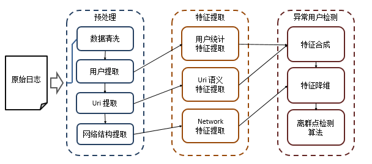
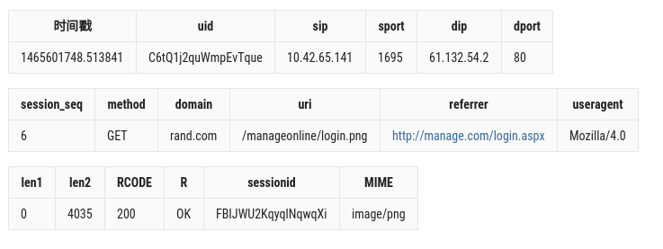
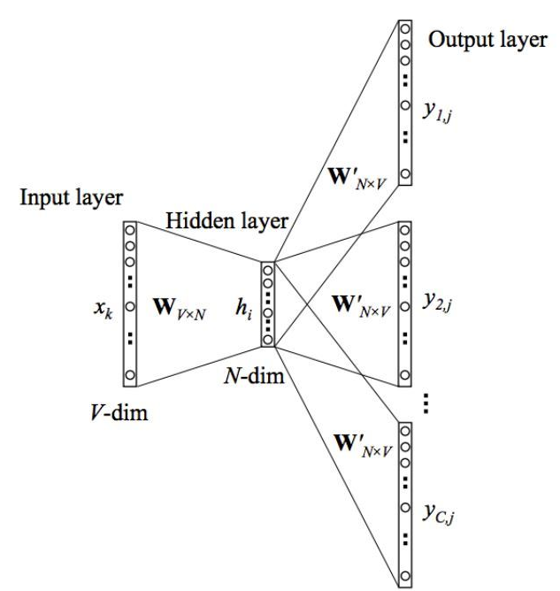
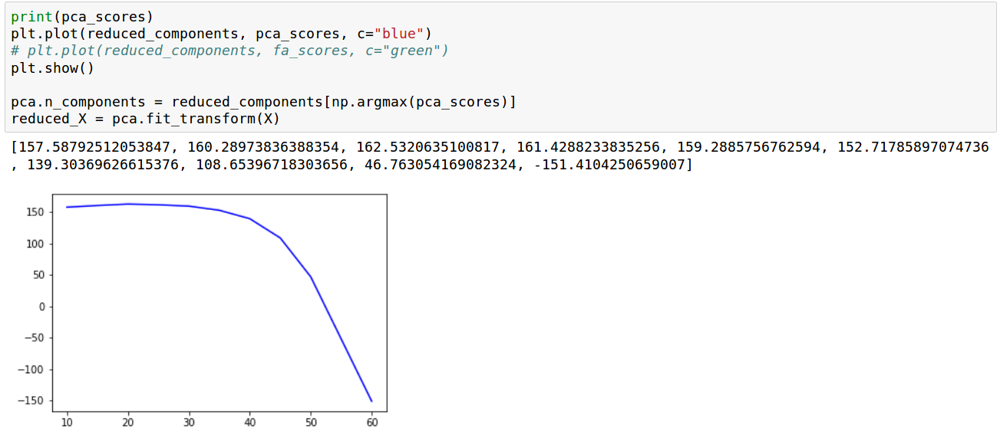

## 一、整体架构图
整体架构分为三个部分，分别为预处理、特征提取和异常用户检测。如下图所示。




## 二、预处理

### 2.1 数据格式
数据共有27个字段，包含信息的有18的字段，下图展示了字段的含义与实例。



### 2.2 数据清洗

主要步骤：
1. 过滤掉不是 27 个字段的记录。
2. 过滤掉下载图片的记录。
3. 统一 Windows 和 Unix 的换行符。
4. 转换响应吗格式。
5. 删除日志中的 agent 字段（大幅压缩空间）。
6. 重新检验字段数是否一致并删除格式不正确的记录。

### 2.3 Uri提取
在`pre.py`中实现该部分功能。目标是从原始日志中分理出Uri字段。


### 2.4 网络结构提取
在`pre.py`中实现该部分功能。目标是从原始日志中提取源IP与目的IP的连接关系，然后重构内网关系图。

在此基础上还需要进行全权重处理操作：对所有的密集连接的IP，弱化其权重。


## 三、特性提取

### 3.1 用户统计特征提取

以下代码展示了特征抽取部分通过统计方法提取到的特征向量。统计特征向量主要包括两个部分：行为特征、uri特征。uri特征部分中的label部分比较复杂，在2.2.3小结单独叙述。

```python
# initial
feature = []             # 定长 1D：最终返回的 user feature

session_length = []      # 1D：每个 session 的 action 个数
duration = []            # 1D：每个 session 的持续时间 (ms)
port = set()             # 1D：使用过的端口集合
category_features = {}   # dict of 2D：bash预处理中被sed过的category特征
action_delta = []        # 2D：一个 session 中每个 action 之间的间隔时长 (ms)
session_month = []       # 1D：session 的开始时间是几月
session_twohour = []     # 1D：session 的开始时间是哪个时辰
session_weekday = []     # 1D：session 的开始时间是周几
len2 = []                # 1D：不区分是哪个 session，全部 flatten 到一维数组中，该数组长度是该 user 的 action 总数
                         # 只对于len2来说，也有0的存在，还是只处理非零部分，零的部分可能是由于非200的http请求
len1 = []                # 1D：同上（由于稀疏，只计算非零部分）
uri_chrlen = []          # 1D：同 len2 (uri feature)
uri_len = []             # 1D：同 len2 (uri feature)
max_query_value = []     # 1D：同 len1 (uri feature)
count_query = []         # 1D：同 len1 (uri feature)
query_chrlen = []        # 1D：同 len1 (uri feature)
query_parts = []         # 1D：同 len1 (uri feature)
labels = []              # 2D: 对于 label，先仅仅是当做类别处理
```

#### session特征
- session_length：session的长度构成的序列。
- duration：session的持续时间构成的序列。
- action_delta：session中每个报文的间隔时间构成的序列。
- session_month：session行为发生的月份构成的序列。
- session_twohour：session行为发生的时间构成的序列。
- session_weekday：session行为是否发生在工作日构成的序列。
- length：record的报文长度构成的序列。不区分是哪个 session，全部 flatten 到一维数组中，该数组长度是该 user 的 action 总数。只处理非零部分，零的部分可能是由于非200的http请求导致的数据稀疏性。
- port：使用的用户端口。
- category_features：session被自动标注的可能的行为类型。后面详细说明标注方法。

### 3.2 uri语义特征提取

用户在一个HTTP访问中的目标uri包含了重要的信息，因此需要单独对其进行处理。

- uri_chrlen：字符级别的的uri长度。
- uri_len：字段级别的uri长度。
- max_query_value：query字段实质为一个键值对，对该部分进行提取特征的原因是考虑到对于某些脆弱的系统，可以利用uri的query进行注入。
- count_query：query个数。
- query_chrlen：query字符级别的长度。
- query_parts：query中的‘？’数目。

#### session label与自动标注算法
- labels：自动标注的uri的label。

该部分是基于主题模型的算法，常见的应用是自动将语义类似的文本降维成为主体分布向量。常见应用是新闻自动分类。比如将带有“政府”，“政策”，“条例”，“国家”，“形势”的文本归属为一类，将带有“疾病”，“疫苗”，“防治”，“感染”的文本聚到一类，等等等等。我们看到这些例子就会知道前者表示与政治相关的文本，后者表示医学相关的文本。该算法的目标就是将一个文本转化为一个d维向量，该向量表示对于d个主题，该文本分别与每个主题的相关程度。这里的相关性矩阵使用tfidf进行重要性加权。

一般这种类型的任务需要构建一个词语与句子的相关矩阵，在本场景下，词指的就是一个uri中的field，句子指的就是一个uri。该算法的有效性基于词语的共闲背后的逻辑。比如在uri中，css常常与layout共同出现；file常常与upload共同出现。有了相关性矩阵后，即可使用主题模型对uri提取特征向量。

使用的算法是LDA（Latent Dirichlet Allocation）算法。最简单的主题模型是LSA算法，该算法对共现矩阵进行奇异值分解；分解的矩阵分别表示文档和主题的相关性与主题与词语的相关性。改进的算法是pLSA，对分解加上概率的归一化限制，即对分解后的矩阵加上概率化解释，表示一个文档有可能属于若干个主题，属于不同主题的概率服从多项式分布，更好的对一词多义现象进行处理；LDA是对pLSA的贝叶斯化版本。

在系统中，该部分分别在`pre.sh`和`SessionLabel.py`中实现，得到降维后的矩阵存放于`tfidf.pkl`缓存文件。然后简单的使用 Kmeans 算法对 uri 进行标注，本质实际上是认为一个 uri 最后可能的主题就是它真正的主题。

### 3.3 Network 特征提取

#### 3.3.1 Embedding 基本思想
网络嵌入方法（Network Embedding）旨在学习网络中节点的低维度潜在表示，所学习到的特征表示可以用作基于图的各种任务的特征，例如分类，聚类，链路预测和可视化。

由于信息网络可能包含数十亿个节点和边缘，因此在整个网络上执行复杂的推理过程可能会非常棘手。因此有人提出了用于解决该问题的一种方法是网络嵌入（Network Embedding）。NE 的中心思想就是找到一种映射函数，该函数将网络中的每个节点转换为低维度的潜在表示。

总的来说，NE 具有如下几个特征：
1. **可扩展性（Scalability）**：真实网络规模通常很大，因此网络嵌入算法应该能够在短时间内处理大规模网络。
2. **社区感知（Community aware）**：潜在表示之间的距离应表示用于评估网络的相应成员之间的相似性的度量。这就要求同质网络能够泛化。
3. **低维（Low dimensional）**当标记数据稀缺时，低维模型更好地推广并加速收敛和推理。
4. **连续性（Continuous）**：需要潜在的表示来模拟连续空间中的社区特征与结构特征。

本质上Embedding可以看做是一种降维技术，但是有两个问题。其一、传统的降维技术难以扩展至大规模结构化数据，比如传统的PCA就是基于线性假设，无法处理数据中的流形特征。其二，网络结构不同于常见的数据样本，特征存在于其链接结构中，重点是将其表示为计算机可以处理的数据向量。传统基于统计的特征工程方法，往往是手动提取节点的度、邻居信息、三角形信息来处理，这种处理方法低效而且以处理者的认知和经验作为上限。网络嵌入就是解决这两个问题的。

对于图嵌入有以下两个方向的研究：其一是以deepwalk为先河的基于Random Walk与Word Embedding结合的方法，**在本模块中采纳的即为这种方法**。其二是从传统机器学习方法中的非线性降维技术中推广而来的embedding技术。其三就是基于深度学习的技术，比如图卷积神经网络、GANS plus NE等等。以下详细介绍本模块中使用的方法。

### 3.3.2 DeepWalk 算法
DeepWalk通过将节点视为单词并生成短随机游走作为句子来弥补网络嵌入和单词嵌入之间的差距。然后，可以将诸如word2vec之类的神经语言模型应用于这些随机游走以获得网络嵌入。

把以节点$$$v_i$$$为起点的随机游走记作$$$W_{vi}$$$。随机游走是一个由随机变量$$$W^1_{vi}$$$,$$$W^2_{vi}$$$,…,$$$W^n_{vi}$$$决定的随机过程，使得$$$W^{k+1}_{vi}$$$是从节点$$$v_k$$$的相邻节点中随机选择的。随机游走在内容推荐和社团发现中被用于衡量相似度。它们也是在输入图的大小的次线性时间内计算局部社团结构信息的一类输出敏感算法的基础。

由于这种与局部结构的联系，于是使用随机游走序列作为从网络中提取信息的基本工具。除了捕获社团信息，使用随机游走作为算法的基础也提供了两个不错的属性：首先，局部探索容易并行化。许多随机游走（在不同的线程、处理器或机器上）可以同时探索一个图的不同部分。其次，依靠从短随机游走获得的信息，可以适应图形结构的小变化而不需要全局重新计算。可以用次线性时间在变化的区域进行新的随机游走来迭代更新学习的模型。

之前用在线随机游走作为捕获图结构的雏形，现在需要一种合适的方法来捕获这些信息。如果连通图的度分布遵循幂定律（即无尺度），观测到在节点出现在短随机游走中的频率也将遵循幂定律分布。自然语言中的词频遵循类似的分布，语言建模技术可以解释这种分布行为。

### 3.3.3 Skip-Gram 模型
该模型的基本思想是：如果两个不同的“单词”具有非常相似的“上下文”（也就是说，他们周围可能出现哪些“单词”），那么我们的模型需要为这两个单词输出非常相似的结果。因此，如果两个“单词”向量相似，那么网路将会为这个两个“单词”输出相似的上下文。假设两个“单词”有相同的上下文，那么我们的网络将会学习相似的向量。

上下文指的就是对于序列来说，某个序列中的元素的前后若干个其他元素，结合到该模型与network的结合，那么节点的上下文实际上就是某个节点的附近的若干个节点。

可以认为该模型的本质是一个单隐层、以Softmax作为输出激活函数、以交叉熵作为损失函数的上下文自编码器。



### 3.3.4 算法使用
该部分工作的实现基于OpenNE开源工具, 下面是具体调用方式。
```python
python3 OpenNE/src/main.py --method deepWalk --weighted --representation-size 16 --clf-ratio 0.9 --number-walks 30 --walk-length 6 --windows-size 3
```
- method：算法类型。
- weighted：是否是加权图。
- representation-size：embedding向量的大小。
- clf-ratio：holdout验证集的比例。
- number-walks：每个节点作为起点的随机游走的次数。
- walk-length：随机游走的长度。
- windows-size：上下文窗口的大小。

以上参数通过sklearn.model_selection.GridSearchCV搜索得到。


## 四、异常用户检测

### 4.1 特征合成
直接基于特征文件进行合成，将两组特征文件使用`paste`命令进行连接。

### 4.2 特征降维

降维算法使用`PCA`。PCA是一种线性的鲁棒的降维手段。`PCA`用于对一组连续正交分量中的多变量数据集进行方差最大方向的分解。`PCA` 被通常实现为一个变换对象， 通过 `fit` 方法可以降维成 n 个主方向， 并且可以将新的数据投影到这些主方向中。

在实际实现中，PCA被实现为另一种方法，即基于`SVD`的方法。通过丢弃具有较低奇异值的奇异向量成分，将数据降维到低维空间并保留大部分方差是等价于`PCA`的原理的。

简单地说，主成分分析（PCA）的原理就是将一个高维向量x,通过一个特殊的特征向量矩阵U，投影到一个低维的向量空间中，表征为一个低维向量y，并且仅仅损失了一些次要信息。也就是说，通过低维表征的向量和特征向量矩阵，可以基本重构出所对应的原始高维向量。


### 4.3 离群点检测算法

#### 4.3.1 算法原理

传统意义上，很多的分类问题试图解决两类或者多类情况，机器学习应用的目标是采用训练数据，将测试数据属于哪个类进行区分。但是如果只有一类数据，而目标是得到数据集中大多数样本的共有特点并依次检测出正常点和异常点的区别的话，该问题就属于Outlier Detection。OVSVM是一种基于SVM的方法，目标是将所有的数据点与零点在特征空间 F 分离开，并且最大化分离超平面到零点的距离。这产生一个binary函数能够获取特征空间中数据的概率密度区域。当处于训练数据点区域时，返回 +1，处于其他区域返回 -1.

该问题的优化目标与二分类SVM略微不同，但依然很相似。SVM的目标是在参数空间中搜索最优决策超平面将正负类样本分割开，OCSVM的目标是搜索得到一个最优的超平面将训练样本点分割出来。因此在基于SVM的约束优化问题形式下，得到OCSVM的求解目标。

$$
\min_{w,\zeta_{i},\rho}\frac{1}{2}||w||^{2}+\frac{1}{\nu n}\sum_{i=1}^{n}{[\zeta_{i}}-\rho]_+ \\ \tag{1} s.t. (w^{T}\phi(x_{i}))>\rho-\zeta_{i},i=1,...,n \\ \zeta_{i}>0 $$

上述公式中$$$[x]_+$$$表示SVM使用的Hinge Loss。代表对于正常样本不计算损失函数，只对于错误样本计算损失，这里的错误样本就是被超平面划分出来的异常点。

上述公式中的$$$\zeta_{i}$$$ 表示松弛变量。对于OCSVM，松弛变量是一个非常重要的参数，如果没有松弛变量是检测不到异常样本的，松弛变量实际上反映了一个样本点的异常强度。

上述公式中的$$$\nu$$$ 类似于二分类SVM中的 C ，在原始的SVM中，C的作用是调整模型正则化的能力，C越大，模型的bias越大，variance越小。在OCSVM中，C的作用是调节异常点和正常点的比例。

上述公式中的 $$$\phi$$$ 是高维映射函数，用于将点映射到高维空间。使得模型从线性模型转为非线性模型。众所周知，对于SVM并不显式的定义映射函数，而是通过将原问题转化为对偶问题的特殊形式后引入kernel trick。对于kernel trick的原理不展开说明。在具体使用中，我们需要调节的参数只有两个，在后面具体说明。

采用Lagrange技术并且采用dot-product calculation，确定函数变为：

$$f(x)=sign((w^{T}\phi(x_{i}))-\rho)=sign(\sum_{i=1}^{n}{\alpha_{i}K(x,x_{i})}-\rho) \tag{2}$$

这个方法创建了一个参数为 $$$w,\rho$$$ 的超平面，该超平面与特征空间中的零点距离最大，并且将零点与所有的数据点分隔开。

#### 4.3.2 算法使用

算法使用基于sklearn.svm.OneClassSVM实现，首先对输入特征进行降维操作。降维方法选择的PCA算法，通过数据降维后的方差作为评估指标。



具体超参数设置如下：
```python
OneClassSVM(nu=0.005, kernel='rbf', shrinking=True)
```

第一个参数nu对应了OCSVM中的正则化系数，简单的理解就是异常点的惩罚系数的权重，或者可以更直白的理解为异常点的大致比例，这里设置为0.5%。

第二个参数是kernel trick中使用的具体核函数，这里使用高斯径向基函数作为核函数，比线性函数更好的捕获距离与聚类的概念。还有一个参数是gamma，这里未作调整，直接使用特征数的倒数作为默认值。

第三个参数对应SVM的加速计算算法shrinking，这里只做简单介绍。**Shrinking技术**的根本思想是如果能预知哪些变量对应着支持向量，则只要在这些样本上训练就够了，其他样本可不予考虑，这不影响训练结果，但降低了问题的规模并有助于迅速求解。进一步，如果能预知哪些变量在边界上(即a=C)，则这些变量可保持不动，只对其他变量进行优化，从而使问题的规模更小，训练时间大大降低。这就是Shrinking技术。Shrinking技术基于这样一个事实：支持向量只占训练样本的少部分，并且大多数支持向量的拉格朗日乘子等于C。实践表明，它对大规模问题，尤其是支持向量的比例很小或者多数支持向量在边界上的情形很有效。其优点是，每个子问题都能用解析方法得到最优解，不需要调用其他优化子程序，于是算法的收敛速度大大提高。
