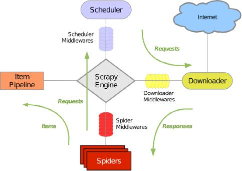
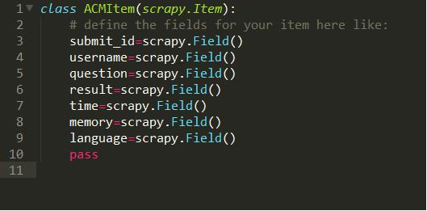
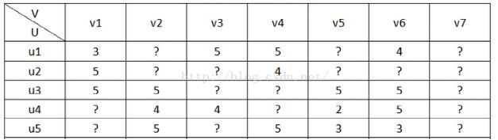

# 数据获取

## 调研

在数据驱动的工作方面，获取数据是工作的第一步，高质量的数据来源又会使得我们的工作事半功倍。对于题目推荐系统，需要的数据自然是大量的题库和用户对于题目的做题情况。首先想到的是类似于猿题库或者易题库或者之类的公司，他们做的是初中高中等试题的推荐系统。然而通过调研发现这些公司的试题来源是有专门的部门进行人工输入，用户做题情况来自于大量的用户对其公司产品的使用情况，这些公司也没有针对开发者的公开接口。而网络上可以获取到的题库大部分零零散散，文件格式不统一，题目格式不统一，存在大量的内容重复或者答案缺失问题。而且下载得到题目数据也没有用户的做题情况，于是便考虑使用爬虫爬取针对性的题目数据和用户做题情况。

在调研的过程中注意到目前有很多免费的ACM题库的OpenJudge平台，这些平台上可以以HTML的形式方便的获取题目列表和用户提交信息，并且格式统一，可读性强，缺失率低，便于进行数据预处理。

## Scrapy爬虫框架

可以使用的开源爬虫项目不胜枚举，其中Java和Python为语言的爬虫框架为主流，比如Nutch、Crawler4j、WebMagic、scrapy、WebCollector等等，其中Nutch是Apache维护的开源项目，是一个为了搜索引擎服务的强大工具。除了国外的很多优秀程序员开发的爬虫，国内也出现了很多不错的开源项目。

Scrapy是一个为了爬取网站数据，提取结构性数据而编写的应用框架。 可以应用在包括数据挖掘，信息处理或存储历史数据等一系列的程序中。

所谓网络爬虫，可以抓取特定网站网页的HTML数据。抓取网页的一般方法是，定义一个入口页面，然后一般一个页面会有其他页面的URL，于是从当前页面获取到这些URL加入到爬虫的抓取队列中，然后进入到新页面后再递归的进行上述的操作，其实说来就跟深度遍历或广度遍历一样。Scrapy 使用 Twisted这个异步网络库来处理网络通讯，架构清晰，并且包含了各种中间件接口，可以灵活的完成各种需求。由于我们的爬虫任务比较简单，因此Scrapy是一个不错的选择。下图是Scrapy的架构和处理流程。

## 目标网站：南洋理工OJ平台

国内有很多OpenJudge的平台，其中，[北京大学 Online Judge（POJ)](http://acm.pku.edu.cn/JudgeOnline/)建立较晚，但题目加得很快，现在题数和ZOJ不相上下，特点是举行在线比赛比较多，数据比ZOJ上的要弱，有时候同样的题同样的程序，在ZOJ上WA，在POJ上就能AC。不过感觉pku的题目要难很多。这个题库的一大特点就是 OnlineJudge功能强大，其实pku现在已经是中国最好的ACM网站。[浙江大学 Online Judge（ZOJ](http://acm.zju.edu.cn), 国内最早也是最有名气的OJ，有很多高手在上面做题。打开速度快。而我们选择的目标站点是[南洋理工ACM](http://acm.nyist.net/JudgeOnline)，原因是这个网站较为轻量级，接口清晰，提交频率较快。下图是南洋理工ACM的首页。

下图是ACM的用户提交情况。

## 数据分析

推荐系统最重要的就是用户效用矩阵，所以上图中用户提交信息中必须获得的field是用户id，题目id和结果。其他信息也一并或取以备后用。而用户对题目得分这里并没有用户直接对题目的评分，只有通过为Accept或者没有通过时出现的各种错误，如Output Limit Exceed/Runtime error/Compilation Error/Wrong Answer等等。因此这一项需要人工处理。

我们的考虑是如果用户对一道题多次提交并且最后成功通过，则认为该用户对该题评分较高，如果只需要一两次提交便通过或者多次提交未能通过，此时的评分较低，因此User-Item的效用是该用户对该题的所有提交记录的线性加权和的对数。

## 下面是数据schema和前几条实例：

我们爬取到的数据是用户的做题记录，而需要喂给算法的数据是user和item之间的效用矩阵，那么怎么给用户定这个分数呢。这里其实我就是拍脑门相处的方法，目标是推荐给用户新的用户想做并且黑有一些难度的题目。我们考虑到题目提交结果有这么几种可能性：CompileError、MemoryOutOfBound、WrongAnswer、Accept，因此用户对题目的分数就设定为一个Accept5分，OOM或者超时都是3分，错误答案是2分，其他是一分，最后取对数。

最后得到的效用矩阵是一个4777*860的矩阵，其中只有0.8%的元素不为零。

# 推荐算法

## 1. 基于矩阵分解的用户推荐算法

用户对物品的打分行为可以表示成一个评分矩阵A(m\*n)，表示m个用户对n各物品的打分情况。如下图所示：

其中，A(i,j)表示用户user i对物品item j的打分。但是，用户不会对所以物品打分，图中？表示用户没有打分的情况，所以这个矩阵A很多元素都是空的，也就是这个矩阵是一个非常稀疏的矩阵，我们称其中的空项为缺失值（missing value）。在推荐系统中，我们希望得到用户对所有物品的打分情况，如果用户没有对一个物品打分，那么就需要预测用户是否会对该物品打分，以及会打多少分。这就是所谓的矩阵补全，将原本没有分数的矩阵填上我们的预测值，然后找到一个用户原本所有空项的位置上的较大的值对应的item即完成了推荐。

Latent Factor Models的核心就是下面这个假设：打分矩阵A是近似低秩的。换句话说，一个 m * n 的打分矩阵 A 可以用两个小矩阵U(m\*k)和V(k\*n)的乘积来近似。换句话说，如果对矩阵进行SVD，那么绝大部分的能量应该集中在某几个较大的奇异值上，剩下的奇异值可能表示模型中的噪声或者用户的一些个性化等等因素。

这样我们就把整个系统的自由度从m×n一下降到了(m+n)\*k。我们接下来就聊聊为什么 ALS 的低秩假设是合理的。世上万千事物，人们的喜好各不相同。但描述一个人的喜好经常是在一个抽象的低维空间上进行的，并不需要把其喜欢的事物一一列出。举个例子，我喜欢看世界观完整的硬科幻作品，不喜欢比较含蓄的言情作品，那么大家根据这个描述就知道我大概会喜欢《黑客帝国》胜过《E.T.》，但不管怎样我对这两个电影的打分应该超过平均分，但是如果让我看&quot;爱在三部曲&quot;，我可能会无聊的睡着。也就是说，人们的喜好宏观上讲不是针对各个作品的，而是针对各个流派的，而流派或者风格的种类数要远远小于作品实例的种类数。我们可以把人们的喜好和电影的特征都投到这个低维空间，一个人的喜好映射到了一个低维向量$$$u_{person}$$$，一个电影的特征变成了纬度相同的向量$$$u_{movie}$$$ ，那么这个人和这个电影的相似度就可以表述成这两个向量之间的内积 我们把打分理解成相似度，那么**打分矩阵A(m\*n)**就可以由**用户喜好特征矩阵U(m\*k)**和**产品特征矩阵V(n\*k)**的乘积来近似表示，这个 k 就是模型中隐含因子的个数。

## 2. 最小交替二乘法ALS

矩阵分解模型的损失函数为：
$$C = \sum_{i,j \in R}[(a_{i,j}-u_iv_j^T)+\lambda(u_i^2+v_j^2)]$$

有了损失函数之后，下面就开始谈优化方法了，通常的优化方法分为两种：交叉最小二乘法（alternative least squares）和随机梯度下降法（stochastic gradient descent）。在spark中使用交叉最小二乘法（ALS）来最优化损失函数。算法的思想就是：我们先随机生成 $$$U^{(0)}$$$, 然后固定它求解 $$$V^{(0)}$$$。

对于具体的优化算法，没有深入研究，直接看参考博文中的推导就行。

## 3. Spark mllib中的ALS算法的使用

我们考虑的是使用spark的mllib来完成推荐系统的实现，一个原因是spark虽然不是专业的机器学习算法工具，但是目前hadoop生态与安静的蓬勃发展使得这种分布式计算平台大有用武之地，且spark在hadoop上的应用，大有为大象插上翅膀的效果。应该说spark的在使用上面的经济成本，性能优势，一站式解决能力，一定会使其大放异彩。机器学习算法一般都有很多个步骤迭代计算的过程，机器学习的计算需要在多次迭代后获得足够小的误差或者足够收敛才会停止，迭代时如果使用Hadoop的MapReduce计算框架，每次计算都要读/写磁盘以及任务的启动等工作，这回导致非常大的I/O和CPU消耗。而Spark基于内存的计算模型天生就擅长迭代计算，多个步骤计算直接在内存中完成，只有在必要时才会操作磁盘和网络，所以说Spark正是机器学习的理想的平台。

而MLlib 构建在apache spark之上，一个专门针对大量数据处理的通用的、快速的引擎。MLlib 是 [Spark](http://lib.csdn.net/base/spark)的可以扩展的 [机器学习](http://lib.csdn.net/base/machinelearning)库，由以下部分组成：通用的学习 [算法](http://lib.csdn.net/base/datastructure)和工具类，包括分类，回归，聚类，协同过滤，降维，当然也包括调优的部分。

首先进行数据预处理将前面提到的json数据进行预处理，并且由RDD转换为DataFrame数据类型，这种数据类型相比RDD来说最显著的优势是具有schema，可以提供访问与处理数据的更强大的接口。其中DataFrame中的元素是一个三元组&lt;userID, questionID, score&gt;，实际上就是矩阵中的一个值。

然后我们可以调用ML中已经实现好的方法来进行计算。

这个实际上是建立了一个ALS计算框架，其中需要程序员配置的参数有如下几个。

- numBlocks 是用于并行化计算的用户和商品的分块个数 (默认为10)。
- rank 是模型中隐语义因子的个数（默认为10）。
- maxIter 是迭代的次数（默认为10）。
- regParam 是ALS的正则化参数（默认为1.0）。 主要用于控制模型的拟合程度，增强模型泛化能力。取值越大，则正则化惩罚越强。大型推荐系统一般需要调参得到合适的值。
- rank：隐含因子数目。这个值会影响矩阵分解的性能，越大则算法运行的时间和占用的内存可能会越多。通常需要进行调参，一般可以取10-200之间的数。
- implicitPrefs 决定了是用显性反馈ALS的版本还是用适用隐性反馈数据集的版本（默认是false，即用显性反馈）。
- alpha 是一个针对于隐性反馈 ALS 版本的参数，这个参数决定了偏好行为强度的基准（默认为1.0）。
- nonnegative 决定是否对最小二乘法使用非负的限制（默认为false）。

其中需要说明的是显性反馈和隐性反馈的区别：显性反馈行为：用户明确表示对物品喜好的行为。隐性反馈行为：不能明确反映用户喜好的行为。

**下图是显性反馈数据和隐形反馈数据的比较**

|   | 显性反馈数据 | 隐性反馈数据 |
| --- | --- | --- |
| 用户兴趣 | 明确 | 不明确 |
| 数量 | 较少 | 庞大 |
| 存储 | 数据库 | 分布式文件系统 |
| 实时读取 | 实时 | 有延迟 |
| 正负反馈 | 都有 | 只有正反馈 |

# **下图是各代表应用中显性反馈数据和隐性反馈数据的例子**

|   | 显性反馈 | 隐性反馈 |
| --- | --- | --- |
| 视频网站 | 用户对视频的评分 | 用户观看视频的日志、浏览视频页面的日志 |
| 电子商务网站 | 用户对商品的评分 | 购买日志、浏览日志 |
| 门户网站 | 用户对新闻的评分 | 阅读新闻的日志 |
| 音乐网站 | 用户对音乐/歌手/专辑的评分 | 听歌的日志 |

得到模型后使用fit方法进行模型的训练，然后使用transform进行测试集的测试或者新数据的预测。Model可以保存下来用于实时计算，后台的模型计算比较耗费时间。

## 参考
1. [ALS矩阵分解算法应用](https://blog.csdn.net/a358463121/article/details/51078341)
2. [深入理解Spark ML：基于ALS矩阵分解的协同过滤算法与源码分析](https://blog.csdn.net/u011239443/article/details/51752904)
3. [推荐系统中的矩阵分解技术](http://www.52nlp.cn/juzhenfenjiedatagrand)

