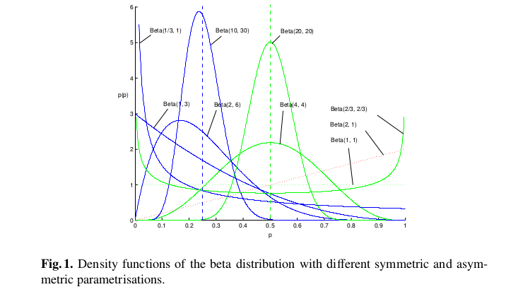
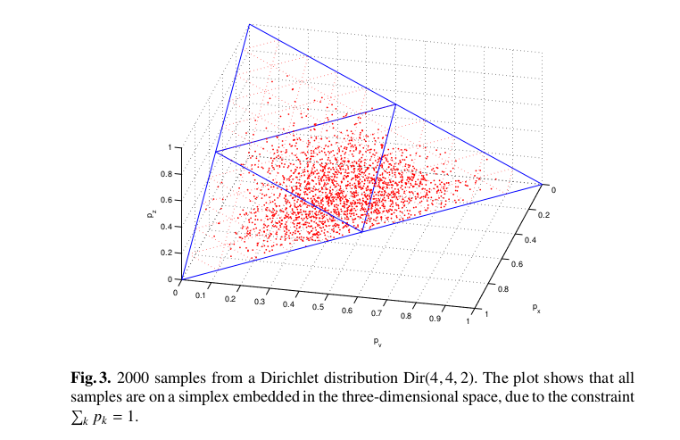
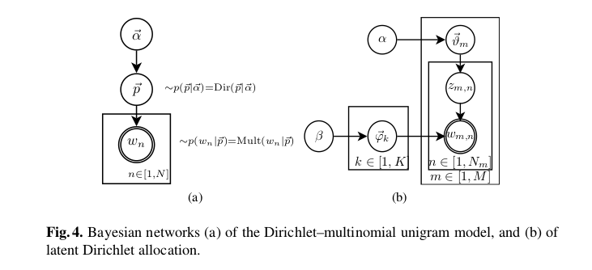
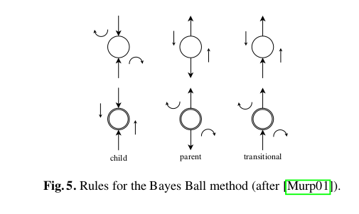
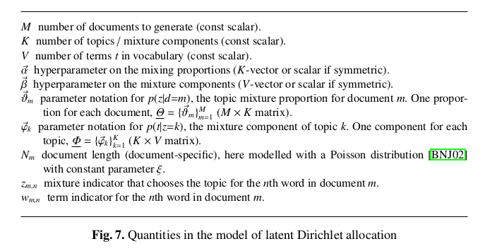
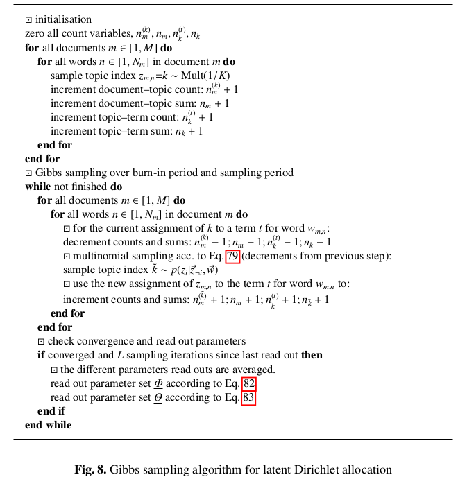

## 2. Parameter estimation approaches

我们面临两个推论问题，(1)一组分布参数的估算值 θ 能最好的解释一组观察 X 和(2)在已有观测结果 X 的前提下，得到新观测 $\tilde x$ 的概率，即计算 $P(\tilde x|X)$ 。我们将前一个问题称为估计问题，后一个问题称为预测或回归问题。

数据集X可以看作是一个随机变量的独立的、同分布的(i.i.d)序列。参数θ是依赖于你所考虑的分布，对于高斯分布，$\theta=\{ \mu, \sigma \}$。

对于这些数据和参数，贝叶斯统计中普遍存在两个概率函数。它们是贝叶斯规则的一部分，如下：

$$P(\theta|X)=\frac{P(X|\theta) \cdot P(\theta)}{P(X)} \qquad(1)$$

对此定义了相应的术语：

$$posterior=\frac{likelihood \cdot prior}{evidence}\qquad(2)$$

在接下来的段落中，我们将会展示不同的估计方法，从简单的似然最大化开始，然后展示如何通过最大化后验来合并参数的先验信念，最后使用贝叶斯规则来推断一个完整的后验分布。

<!-- more -->

### 2.1 Maximum likelihood estimation
最大似然估计试图找到使似然最大化的参数。

$$L(\theta|X)=P(X|\theta)=\bigcap_{x\in X}\{x|\theta\}=\prod P(x|\theta)\qquad(3)$$

由于上式中的连乘，使用对数似然是数值计算更加简单，因此，MLE有如下形式：

$$\hat\theta_{ML} = argmax_{\theta}LL(\theta|X) = argmax_{\theta}\sum_{x\in X}logP(x|\theta)\qquad(4)$$

获得参数估计的常用方法是求解系统:

$$\frac{\partial LL(\theta|X)}{\partial\theta_k}=0 \qquad \forall \theta_k \in \theta\qquad(5)$$

此时新观测到的数据可以被这样**近似的**估计概率：

$$P(\tilde x|X) = \int P(x|\theta)P(\theta|X)d\theta\qquad(6)\\ \simeq \int P(x|\tilde\theta_{ML})P(\theta|X)d\theta = P(\tilde x|\hat\theta_{ML})\qquad(7)$$

也就是说，会估计下一个数据产生的概率是使用当前估计参数控制下的分布中采样的概率。

#### 例题
抛硬币20次中，12次正面,8次反面。估计硬币正面向上的概率。

对与该问题，正面向上的次数服从Bernoulli分布，但是参数未知，使用上面所述的MLE方法进行估计。

$$ LL = \sum_{i=1}^NlogP(c|p) =\\ n^{(1)}logP(1|p)+n^{(0)}logP(0|p) = n^{(1)}p+n^{(0)}(1-p) \qquad(10)$$

令梯度为零可以得到极大似然估计的参数：

$$\hat\theta_{ML} = \frac{n^{(1)}}{N}\qquad(11)$$

这个结果可解释性很强，我们认为估计值就是正面次数与样本总数之比。在这个例子中，我们可以假设我们的硬币是严重变形的。

### 2.2 Maximum a posteriori estimation

最大后验(MAP)估计非常类似于ML估计，但是MAP可以通过一定权重的先验分布p(θ)来在估计值中加入一些先验信念。这个名字来源于最大值的目标是在给定数据的情况下最大化参数的后验概率。这一点和MLE不同，MLE最大化的目标是likelihood，MAP最大化的目标是posterior。使用前述的贝叶斯公式(1)(2)对后验概率进行分解，如下：

$$\hat\theta_{MAP}= argmax_{\theta}P(\theta|X) \qquad(12)\\= argmax_\theta\frac{P(X|\theta) \cdot P(\theta)}{P(X)} = argmax_\theta P(X|\theta)\cdot P(\theta) = argmax_{\theta}\{LL(\theta|X) + logP(\theta)\}=argmax_{\theta}\{LL(\theta|X)+logP(\theta)\}\\=argmax_{\theta}\{\sum_{x\in X}logP(x|\theta) + logP(\theta)\} \qquad(13)$$

与(4)相比，在似然中增加了先验分布的信息。在实践中，先验p(θ)可以用来编码额外的知识，使得求解目标偏好更简单的模型来预防过拟合,这被称为**Occam's Razer**。

通过引入p（θ），MAP遵循贝叶斯方法进行数据建模，其中参数θ被认为是r.v.s. 对于自身参数化的先验，即具有超参数α的p（θ）：= p（θ|α），可以在概率框架内表达θ的预期值的信念，并且创建参数的层次。

MAP参数估计可以通过最大化项 $ L(θ|X)+ log p(θ)$ 来找到，从形式上看与(5)很相似。类似于(7)的做法，给定数据X，新观测的概率$\tilde x$可以使用以下近似值：

$$P(\tilde x|X) \simeq \int P(\tilde x|\hat\theta_{MAP})P(\theta|X)d\theta = P(\tilde x|\hat\theta_{MAP}) \qquad(14)$$

#### 例题
抛硬币20次中，12次正面,8次反面。估计硬币正面向上的概率。

题目与之前一样，不过现在我们认为Bernoulli分布的参数会有更大的概率取某些特定的值，例如，我们认为硬币通常是公平的。这可以表示为具有0.5左右的高概率的先验分布。 我们选择beta分布：

$$P(p|\alpha, \beta)=\frac{1}{B(\alpha, \beta)}p^{\alpha-1}(1-p)^{\beta-1}=Beta(p|\alpha,\beta) \qquad(15)$$

其中，Beta函数是对Gamma函数的扩展：

$$B(\alpha, \beta)=\frac{\Gamma(\alpha)\Gamma(\beta)}{\Gamma(\alpha+\beta)}$$

*译者注：有关Beta分布的内容没有翻译过来。*

在我们的例子中，我们相信一个硬币有很大概率是地址均匀的，因此我么设置α=β= 5，这导致模式（最大值）为0.5的分布。优化问题现在变成了：

$$\frac{\partial}{\partial p}LL+logp(\theta)=\frac{n^{(1)}}{p}-\frac{n^{(0)}}{1-p}+\frac{\alpha-1}{p}-\frac{\beta-1}{1-p}=0\qquad(16)\\
\Leftrightarrow \hat p_{MAP}=\frac{n^{(1)}+\alpha-1}{n^{(1)}+n^{(0)}+\alpha+\beta-2}=\frac{n^{(1)}+4}{n^{(1)}+n^{(0)}+8}\qquad(17)$$

这个结果在两个方面很有意思。第一点是估计p的变化行为，bernoulli实验的计数$n^{(c)}$，他们使得我们最终的的估计值向先验移动。超参数α和β的值越高，修改由它们表达的先验信念所需的实际观察就越多。第二个有趣的方面是和$n^{(1)}+α-1$和$n^{(0)}+β - 1$的唯一出现：计数究竟来自实际观察或先验信念对于最终的参数估计来说无关紧要。这就是超参数α和β通常被称为伪计数的原因。存在较高的伪计数，β分布更加集中在其最大值附近。根据我们的20次实验结果，$\tilde p_{MAP} = 16/28 = 0.571$，与MLE的结果0.6相比，显示了先验信念对硬币“公平性”的影响。

### 2.3 Bayesian estimation

贝叶斯估计是对极大后验估计的扩展，贝叶斯方法估计参数集θ上的整体分布而不是直接对分布进行点估计。不仅将数据生成参数的最大值（后验值）编码，而且还将期望作为另一参数估计，并使其作为估计质量或置信度的度量的方差信息。 这种方法的主要步骤是根据贝叶斯规则计算后验：

$$P(\theta|X)=\frac{P(X|\theta) \cdot P(\theta)}{P(X)} \qquad(18)$$

由于我们不限制计算以找到最大值，因此有必要计算归一化项，即“evidence”的概率。

$$p(X)=\int_\theta P(X|\theta)P(\theta)d\theta\qquad(19)$$

随着新数据的观察，Eq18的后验会自动调整，最终可以对其统计数据进行分析。 然而，Eq19中的归一化积分通常是贝叶斯估计的复杂部分，将在下面进一步处理。 在预测问题中，贝叶斯方法通过确保Eq14中的精确相等来扩展MAP，然后变为：

$$P(\tilde x|X) = \int P(\tilde x|\theta)P(\theta|X)d\theta\qquad(20)\\=\int P(\tilde x|\theta)\frac{P(X|\theta) \cdot P(\theta)}{P(X)}d\theta \qquad(21)$$

这里后验p(θ|X)代替参数值θ的显式计算。 通过对θ的积分，先验信念自动地并入预测中，预测本身是x上的分布，并且可以计算置信度，例如通过其方差。

接着举个栗子，我们建立一个贝叶斯估计器，用于上述具有N个伯努利观测的情况。我们的先验依然用参数为(5,5)的β分布表示。除了最大后验值之外，我们还需要计算随机参数p的期望值和估计置信度的度量。

$$P(p|C,\alpha,\beta)=\frac{\prod_{i=1}^NP(c_i|p)P(p|\alpha,\beta)}{\int_0^1\prod_{i=1}^NP(c_i|p)P(p|\alpha,\beta)d\theta}\qquad(22)\\
=\frac{p^{n^{(1)}}(1-p)^{n^{(0)}}\frac{1}{B(\alpha, \beta)}p^{\alpha-1}(1-p)^{\beta-1}}{\int_0^1 p^{n^{(1)}}(1-p)^{n^{(0)}}\frac{1}{B(\alpha, \beta)}p^{\alpha-1}(1-p)^{\beta-1}dp}\qquad(23)\\
=\frac{p^{n^{(1)}}(1-p)^{n^{(0)}}p^{\alpha-1}(1-p)^{\beta-1}}{\int_0^1 p^{n^{(1)}}(1-p)^{n^{(0)}}p^{\alpha-1}(1-p)^{\beta-1}dp}\\
=\frac{p^{n^{(1)}+\alpha-1}(1-p)^{n^{(0)}+\beta-1}}{\int_0^1p^{n^{(1)}+\alpha-1}(1-p)^{n^{(0)}+\beta-1}dp}\\
=\frac{p^{n^{(1)}+\alpha-1}(1-p)^{n^{(0)}+\beta-1}}{B(n^{(1)}+\alpha,n^{(0)}+\beta)}\qquad(24)\\
=Beta(p|n^{(1)}+\alpha,n^{(0)}+\beta)\qquad(25)$$

**译者注：22到25的推导过程实际上展示的是Beta-Binomial共轭结构，即：$P(p|\alpha,\beta)+BinomialCount(m1, m2)=P(p|\alpha+m1,\beta+m2)$，其中23-24之间的部分是译者个人加入的中间步骤。**

易知，Beta分布的均值为$\frac{\alpha}{\alpha+\beta}$，方差为$\frac{\alpha\beta}{(\alpha+\beta+1)(\alpha+\beta)^2}$，直接带入计算，结果为：
$$E = \frac{n^{(1)}+5}{N+10} = 0.567\qquad(26)$$
$$Var = \frac{(n^{(1)}+5)(n^{(0)}+5)}{(N+11)(N+10)^2}= 0.0079\qquad(27)$$

期望与MAP估计不同，后者是后验分布的最大值而不是期望值。但是，如果计数和伪计数的总和变大，则期望值和最大值都会收敛。

## 3. Conjugate distributions

贝叶斯模型的计算通常变得非常困难，例如，因为边际似然的求和或积分是难以处理（译者注：见21）的或存在未知变量。 幸运的是，贝叶斯方法为先验信念的编码留下了一些自由，并且促进模型推理的常用策略是使用共轭先验分布。

### 3.1 Conjugacy
对于似然p(x|θ)的共轭先验分布p(θ)，可以使得后验分布p(θ|x)和先验分布具有相同的形式，只是参数不同。

等式25说明了这一点：后验分布是像先验一样的β分布，并且归一化项Z的确定很简单（译者注：在上面的例子中，归一化项是一个Beta函数，并且作为Beta分布的一部分存在）。

除了计算简化之外，共轭通常会导致对超参数的有意义的解释，并且在我们的β-Bernoulli共轭情况下，得到的后验可以被解释为：观察计数被添加到先验的伪计数中α和β。

此外，共轭先验似然对通常允许以closed-form对被估计参数（举的例子中就是硬币正面向上的概率p）计算边际似然参数，从而直接根据超参数表达观察的可能性。 对于beta-Bernoulli案例，这看起来如下：

$$P(C|\alpha,\beta)=\int_0^1P(C|p)P(p|\alpha,\beta)dp\qquad(28)\\
=\int_0^1 p^{n^{(1)}}(1-p)^{n^{(0)}}\frac{1}{B(\alpha, \beta)}p^{\alpha-1}(1-p)^{\beta-1}dp\qquad(29)\\
=\frac{1}{B(\alpha,\beta)}\int_0^1p^{n^{(1)}+\alpha-1}(1-p)^{n^{(0)}+\beta-1}dp\qquad(30)\\
=\frac{n^{(1)}+\alpha,n^{(0)}+\beta}{B(\alpha,\beta)}=\frac{\Gamma(n^{(1)}+\alpha)\Gamma(n^{(0)}+\beta)}{\Gamma(n^{(1)}+\alpha+n^{(0)}+\beta)}\frac{\Gamma(\alpha)\Gamma(\beta)}{\Gamma(\alpha+\beta)}\qquad(31)$$

该结果可用于预测未来伯努利试验的分布，而无需事先观察参数p的明确知识。 对于一个新的观测，可以这样计算似然：
$$p(\tilde c=1|C,\alpha,\beta)=\frac{p(\tilde c=1, C|\alpha,\beta)}{p(C|\alpha,\beta)}=\frac{\frac{\Gamma(n^{(1)}+\alpha+1)}{\Gamma(n^{(1)}+n^{(0)}+\beta+\alpha+1)}}{\frac{\Gamma(n^{(1)}+\alpha)}{\Gamma(n^{(1)}+n^{(0)}+\beta+\alpha)}}\qquad(32)\\
=\frac{n^{(1)}+\alpha)}{n^{(1)}+n^{(0)}+\beta+\alpha}\qquad(33)$$

其中33的推导利用了Gamma的阶乘性质。

如上所述，有几个重要的先验似然对可用于简化贝叶斯推断。 与β分布相关的一个重要例子是二项分布，它给出了从参数p的N次伯努利实验中的$n$次为真概率：

$$P(n|p,N)=\begin{pmatrix}
N \\
n
\end{pmatrix}p^{n}(1-p)^{N-n}=Bin(n|p,N)\qquad(34)$$

对于二项分布，由于其参数p具有与伯努利分布相同的含义，因此二项分布的共轭分布也是β分布。其他计算伯努利试验的分布也属于该方案，例如负二项分布。

### 3.2 Multivariate case

到目前为止考虑的分布处理二元实验的结果。 如果我们将可能事件的数量从2推广到有限整数K，我们可以获得K维伯努利或多项式实验，例如骰子的滚动。 如果我们重复这个实验，我们获得观察事件计数（骰子点面）的多项分布。

$$P(\vec n|\vec p,N)=\begin{pmatrix}
N \\
\vec n
\end{pmatrix}\prod_{k=1}^Kp_k^{n^{(k)}}=Bin(\vec n|\vec p,N)\qquad(35)$$

$$P(C|\vec p,N)=\prod_{n=1}^Np_{c_i}=\prod_{k=1}^Kp_k^{n^{(k)}}\qquad(36)$$

注意式子36，对比多项式分布，缺少正规化多项式系数。这种差异是由于我们假设N个实验的结果序列C是固定的，不是获得特定多项式计数向量。真正的多项式分布可能是由N个不同的序列C生成的。在建模文本观察中，这种形式的多项实验非常重要。实际上可以这么认为，我们依然认为我们的分布是多项式分布，只不过由于实验的可交换性，我们不关心序列顺序，因此前面的序列种类数直接不考虑。在实际推导中，这个组合数作为一个常数也会被消掉，只要我们确定各个实际发生的次数固定。比如大家可能没有注意到，前面极大似然估计的时候，虽然使用的是二项分布，不过同样没有考虑这个组合数。

对于多项分布的参数p，共轭先验是Dirichlet分布，它推广β分布从2到K维。

$$P(\vec p|\vec \alpha)=Dir(\vec p|\vec \alpha)=\frac{\Gamma(\sum_{k=1}^{K}\alpha_k)}{\prod_{k=1}^{K}\Gamma(\alpha_k)}\prod_{k=1}^Kp_k^{\alpha_k-1}\qquad(39)\\
=\frac{1}{\Delta(\vec\alpha)}\prod_{k=1}^Kp_k^{\alpha_k-1}\qquad(40)$$

其中，$\Delta(\vec\alpha)$是“Dirichlet delta function”，可以认为是Beta函数的多项式扩展。如果$\vec\alpha$向量中，各个分量取值相同，则被称为对称狄利克雷分布。

## 3.3 Modelling text

考虑对文本集合W建模，W中有多篇文档，每篇文档有多个词w。我们这里使用词袋模型，因此词与词之间具有可交换性。此时考虑从一个大小为V的词典中抽样出N个词构成的文本样本，似然为：

$$L(\vec p|\vec w)=\prod_{t=1}^Vp_t^{n^{(t)}}, \qquad\sum n^{(t)}=N, \qquad\sum p^{(t)}=N\qquad(43)$$

这个例子是Unigram模型，p是在文档中观察到术语t作为单词w的概率服从一次实验的多项式分布。 unigram模型假定所考虑的整个文本只有一种可能性（词袋模型），例如对于语言或语料库的一般假设是有用的。该模型不区分文档与文档之间的区别，即认为没有主题的区别，尽管十分简单，但是它是开发更复杂模型的完美基础。

假设存在共轭结构，词汇表的参数向量p可以用Dirichlet分布建模先验信息。 类似于Eq25，我们获得了Dirichlet后验的重要性质，即将多项式观测计数与先验pseudo-counts相结合：

$$P(\vec p|W, \vec\alpha)=\frac{P(\vec p,W|\vec\alpha)}{P(W|\vec\alpha)}=\frac{\prod_{n=1}^NP(w_n|\vec p)P(\vec p|\vec\alpha)}{\int\prod_{n=1}^NP(w_n|\vec p)P(\vec p|\vec\alpha)d\vec p}\qquad(44)\\
=\frac{\prod_{i=1}^Vp^{n^{(i)}}\frac{1}{\Delta(\vec\alpha)}p^{\alpha_i-1}}{\int \prod_{i=1}^Vp^{n^{(i)}}\frac{1}{\Delta(\vec\alpha)}p^{\alpha_i-1}d\vec p}\qquad(45)\\
=\frac{1}{\Delta{\vec n+\vec\alpha}}\prod_{i=1}^Vp^{n_i+\alpha_i-1}\qquad(46)\\
=Dir(\vec p|\vec\alpha+\vec n) \qquad(47)$$

上述推导展示了Beta-Bernoulli共轭，用于得到新的观察结果后得到参数的后验估计分布，这个过程是inference（在统计学中，inference是指在某些观测数据条件下拟合分布参数的过程）。

对于prediction，对于参数$\vec p$，不要仅仅是使用单纯的基于gram的语料统计，更好的做法是，使用dirichlet先验的pseudo-count得到先验分布，然后计算对于$\vec p$的边缘概率。

$$P(W|\vec\alpha) = \int P(W|\vec p)P(\vec p|\vec\alpha)d\vec p\qquad(48)$$

与式子30中的二元情形相比，积分范围不再是[0,1]，因为多项分布的公式没有明确地包括$\sum_kp_k=1$。 通过添加该约束，积分域P变为嵌入在K维空间中的平面（K-1）-单纯型，由在每个维度的轴上连接点$p_k=1$的线界定。

$$P(W|\vec\alpha) = \int \prod_{n=1}^NMult(w_n|\vec p,1)Dir(\vec p|\vec\alpha)d\vec p\qquad(49)\\
=\int \prod_{i=1}^Vp_i^{n^{(i)}}\frac{1}{\Delta(\vec\alpha)}p^{\alpha_i-1}d\vec p\qquad(50)\\
=\frac{1}{\Delta(\vec\alpha)}\int \prod_{i=1}^Vp_i^{n^{(i)}+\alpha_i-1}d\vec p\qquad(51)\\
=\frac{\Delta(\vec n+\vec\alpha)}{\Delta(\vec\alpha)}\qquad\qquad\qquad\qquad(52)$$

与beta-Bernoulli案例类似，结果表明在给定已经观察到的术语的伪计数的情况下观察到的术语的分布，没有任何其他统计。 更重要的是，类似的参数边缘化对于在下面进一步描述LDA中的后向推断是重要的。 方程式中的分布 52也被称为Dirichlet-multiinomial分布或Pólya分布。

## 4. Bayesian networks and generative models

本节回顾了两种密切相关的方法来表达系统或现象的概率行为：贝叶斯网络，其中条件统计独立性是一个重要方面，以及可用于根据随机分布直观地表达观察的生成模型。

### 4.1 Bayesian networks

贝叶斯网络（BN）是一种形式化的图形语言，用于表示系统的随机变量的联合分布，这是通过考虑所有的随机变量以及他们在有向图中的条件依赖来做到的。 BN是图模型的一个特例，它是机器学习中的一种重要方法，它还包括无向图形模型（马尔可夫随机场）和混合模型。通过仅考虑最相关的依赖关系，推理计算被大大简化。如果假设所有变量之间的依赖性，数量级会是呈指数级渐进增长。

贝叶斯网络形成有向无环图，其节点对应于随机变量，边对应于条件概率分布。其中边的source代表的条件变量被称为父节点，孩子节点是the dependent variable。贝叶斯网络区分evidence node和hidden node，前者对应于观察到或假设观察到的变量，后者对应于潜在变量。

在许多模型中，存在共享父母或孩子的节点的复制，例如，考虑多个值或混合成分。这种复制可以用`plate`来表示，它框住节点并且在右下角标有复制计数或索引变量的集合声明。

图形语言的所有元素都可以在上一节所示的Dirichlet多项式模型中看到，其相应的BN如图4（a）所示。 w表示证据节点，即（假设）观察到的变量，这用双圈表示。w被plate框住，表示N个iid样本。先验参数$\vec α$和未知变量$\vec p$是隐藏变量。

### 4.2 Conditional independence and exchangeability

贝叶斯网络有效地编码随机变量之间的依赖结构，其可以从图的拓扑确定。 在此拓扑中，相关的独立属性是*条件独立*：如果$p(X,Y|Z)=p(X|Z)p(Y|Z)$，则认为已知条件Z，两个变量X和Y是条件独立的，符号记住$X⊥Y|Z$。 对条件独立性的口头解释是，知道Z，关于变量X的任何信息都不会添加到关于Y的信息，反之亦然。这里的信息可以包括观察或参数。

#### Markov conditions

在贝叶斯网络中，有两个关于节点的条件独立性的一般规则。 第一个基于*Markov blanket*：markov blanket指的是这样节点构成的BN的子图：节点的父母，其子女及其子女的父母的集合。该条件表明节点Xi在给定其markov blanket时，条件独立于所有其他节点Xj:$B（X i）：X_i⊥X_j|B(X_i)$

第二个规则是指节点的*non-descendants*集合：在所有BN节点的序列中，确保没有节点出现在其任何父节点之前（拓扑排序），节点的前导节点中的所有不是父节点的节点都是其non-descendants。 该规则规定节点$X_i$，在给定其父节点$P(X_i)$情况下，始终在条件上独立于其non-descendants $N(X_i)$：$X_i⊥N(X_i) | P(X_i)$。

#### Bayes Ball
为了确定BN中任何节点X⊥Y| Z之间的条件独立性，一种直接的方法被称为“贝叶斯球”，它试图将消息（贝叶斯球）从X传播到Y，给出节点Z的观测值：当且仅当（iff）没有办法将球从X传递到Y时，X⊥Y| Z为真，图5中给出的规则中双圈对应于观察到的或给定的变量。

总而言之，贝叶斯球的规则规定子节点阻止传播，如果它们被隐藏，而父节点和过渡节点阻止传播，如果它们被给定或观察到（译者注：详细内容可参考[贝叶斯球](https://blog.csdn.net/u014313009/article/details/39780847?locationNum=14&fps=1)）。该方法也适用于节点集$\{X_i\}⊥\{Y_j\} | \{Z_k\}$，并且如果给定节点集$\{Z_k\}$，所有节点对$（X_i，Y_j）$被*d-separated*，则条件独立性成立 ，即没有贝叶斯球路径存在。

#### Exchangeability

比条件独立更强且在贝叶斯统计中重要的独立关系是可交换性。 任何有限的随机变量序列$\{X_n\}_n$被称为可交换的，如果它的联合分布对其顺序的任何排列是不变的。 对于无限序列，这是任何有限子序列都满足可交换性，就可以说，该无限序列满足无限可交换性。

De Finetti定理推导了可交换性的重要性，该定理指出无限可交换的随机变量序列的联合分布等同于从一些先验分布中采样随机参数并随后基于该随机参数从分布中进行独立同分布采样。然后联合分布是$P(\{x_m\}_{m=1}^M)=\prod_{m=1}^MP(x_m|\theta)$

在贝叶斯网络图形语言中，给定父变量的可交换性是应用plates表示法的条件，并且在给定父节点时，可以假设变量i.i.d.。 在贝叶斯文本建模中，可交换性对应于词袋假设。

### 4.3 Generative models

贝叶斯网络的优势在于它们提供了对所观察到的现象的直观描述，即所谓的生成模型，该模型说明了如何通过随机变量（样本）的采样以及它们沿着网络有向边的传播来生成观察结果。变量依赖性和边缘通常可以通过因果关系来证明，这种关系可以重现真实现象或者用作人工变量。

对于Dirichlet-multinomial模型的简单情况，unigram 的生成模型如下所示：

$$\vec p=Dir(p|\alpha)\qquad(53)$$
$$w=Mult(w|\vec p)\qquad(54)$$

这意味着，从Dirichlet分布中采样参数p的矢量，然后从参数为p的多项式中采样单词w。 贝叶斯推断的任务是“反转”生成模型并从给定的观察中“生成”参数值，试图应对任何隐藏的变量。 对于示例模型，这已在Eq52中显示，其中隐藏变量p通过对其计算边缘概率（积分）来处理。 但是，只有在特殊情况下才有可能以这种方式得到完整的后验，在下一节中我们将看到如何在像LDA这样的更复杂的模型中进行推理。

## 5. Latent Dirichlet allocation

潜在Dirichlet分配（LDA）是一种概率生成模型，可用于通过无监督学习来估计多项式观测的性质。关于文本建模，LDA是一种执行所谓的潜在语义分析（LSA）的方法。 LSA背后的直觉是在文本语料库中找到“主题”或“概念”的潜在结构，它捕获了被“单词选择”噪声所掩盖的文本的含义。LSA分析由Deerwester提出，Deerwester凭经验证明文本文档中术语的共现结构可用于恢复这种潜在的主题结构，特别是没有任何背景知识的使用。反过来，文本的潜在主题表示允许对同义词和多义词等语言现象进行建模。这允许信息检索系统以适合于在意义级别而不是通过词汇同余匹配用户需求（查询）与内容项的方式来表示文本。

LDA是与Hofmann的概率潜在语义分析（PLSA）紧密相关的模型，他们都是latent aspect method在潜在语义分析任务中的具体应用。 更具体地说，LDA通过定义完整的生成模型来扩展PLSA方法，并且Girolami和Kaban证明了具有均匀先验Dir（1）的LDA是与提供ML或MAP估计的PLSA的相同模型，不过前者提供了完整的贝叶斯估计。

### 5.1 Mixture modelling

LDA是混合模型，即，它使用一组分量分布的凸组合来模拟观察。 凸组合是加权和，其加权比例系数总和为1。 在LDA中，从主题z的凸组合生成单词w。 在这种混合模型中，单词w实例化术语t的概率是：

$$P(w=t)=\sum_kP(w=t|z=k)P(z=k),qquad\sum P(z=k)=1\qquad(55)$$

在该混合分布中，每个混合分量是给定主题时，语料库中每个单词的Multinomial分布。混合比例由主题概率$p(z=k)$给定。但是，LDA在全局主题比例的基础上更进一步，并对不同文档的主题概率进行了调整。基于此，我们可以形式化LDA推理的主要目标：

1. 对于每一个主题k，给定主题时单词的多项式分布$P(t|z=k)=\vec\phi_k$
2. 对于每一篇文档m，给定文档时主题的多项式分布$P(z|d=m)=\vec\theta_m$

被估计的参数集$\Phi=\{\vec\phi\}_{k=1}^K$和$\Theta=\{\vec\theta\}_{m=1}^M$是词和文档的潜在语义表示的基础。

### 5.2 Generative model
为了推导出推理策略，我们将LDA视为生成模型。 考虑图4（b）所示的贝叶斯LDA网络。这可以解释如下：LDA生成可观察单词w的流，并分割成文档。对于这些每一个文档，确定其主题比例$\vec θ$，并且由此生成特定主题对应分布下的单词。也就是说，对于每个单词，根据文档特定的混合比例对单词归属的主题标识符$z_{m,n}$进行采样，然后使用相应的主题特定的单词分布$\phi$来采样得到具体单词。**主题分布$\vec\phi_k$在整个过程中只被采样一次。**
(译者注：意思是对于一篇文档中的不同单词，他们的$\phi_k$是一样的，意味着从同一个主题分布中采样单词所属的主题。不同文档的$\phi$不同，需要每次从一个Dirichlet分布中采样。具体见图6的伪代码，在伪代码中，$\Phi$和$\Theta$都只被赋值一次。)

因为LDA可以灵活地为每个观察到的单词分配不同的主题（以及每个文档的不同主题比例），所以该模型不仅是mixture model，而且实际上准确的说是admixture model。在遗传学中，admixture是指其组分本身是不同特征的混合物的混合物。 Pritchard特别为离散数据的admixture进行了贝叶斯模拟，甚至在LDA被提出用于文本之前就已经建立了群体遗传模型。~~完整的生成模型如图14所示。 图5.2给出了所有涉及的数量的列表~~

### 5.3 Likelihood

根据该模型，给定LDA参数的单词w实例化特定项t的概率是：

$$P(w_{m,n}=t|\vec\theta,\Phi)=\sum_{k=1}^KP(w_{m,n}=t|\vec\phi_k)P(z_{m,n}=k|\vec\theta_m)\qquad(56)$$

这只是式子55中混合模型的另一种表述，它对应于贝叶斯网络的plate上的一次迭代。 从贝叶斯网络的拓扑结构中，我们可以进一步指定文档的**complete-data**的似然，即给定超参数的所有已知和隐藏变量的联合分布：

指定此分布通常是简单的并且可以用于其他推导的基础。因此，我们在式子57的基础上可以推导一篇文章$\vec w_m$被生成的似然，即所有文档中的单词被生成的联合概率，为了做到这一点，需要式子57中的因变量积分来求解边缘概率。

$$P(\vec w_m|\vec\alpha,\vec\beta)\\
=\int\int P(\vec\theta_m|\vec\alpha)P(\Phi|\vec\beta)\prod_{n=1}^{N_m}\sum_{z_{m,n}}P(w_{m,n}|\vec\phi_{z_{m,n}})P(z_{m,n}|\vec\theta_m)d\Phi d\vec\theta_m\qquad(58)\\
=\int\int P(\vec\theta_m|\vec\alpha)P(\Phi|\vec\beta)\prod_{n=1}^{N_m}\sum_{z_{m,n}}P(w_{m,n}|\Phi,\vec\theta_m)d\Phi d\vec\theta_m\qquad(59)$$

译者注：式子59中里面的连乘是一篇文档完全数据的似然，然后整个式子是不完全数据的似然。

最后，整个语料库的似然是每个文档的似然的乘积：

$$P(W|\vec\alpha,\vec\beta)=\prod_{m=1}^MP(\vec w_m|\vec\alpha,\vec\beta) \qquad(60)$$

### 5.4 Inference via Gibbs sampling

尽管LDA是一个相对简单的模型，但精确推断通常是难以处理的。 对此的解决方案是使用近似推理算法，例如平均场变分期望最大化，期望传播和吉布斯采样。

吉布斯采样是马尔可夫链蒙特卡罗（MCMC）模拟的一种特殊情况，并且通常产生相对简单的算法，用于在诸如LDA的高维模型中进行近似推断。 因此，我们选择这种方法并提出一个比Griffiths和Steyvers更详细的推导。 ~~在类似LDA的模型中采用Gibbs采样的另一种方法是由于Pritchard等人实际上抢占了LDA对其混合模型的解释，并为与贝叶斯PLSA相当的模型制定了直接Gibbs采样算法。~~

MCMC方法可以通过马尔可夫链的**稳态行为**来模拟高维概率分布 $p(\vec x)$。这意味着在达到马氏链的稳态之后，在马氏链中的每个转移生成一个样本，但是这要保证此时的马氏链已经进入稳态，即消除了初始化参数的影响（度过所谓“burn-in period”之后）。 吉布斯采样是MCMC的一个特例，其中对变量的各个维度$x_i$一次一个地交替采样，以所有其他维度的值为条件，我们用$\vec x_{\lnot i}$表示。该算法的工作原理如下：

1. 选择一个维度 i（无论是随机的还是轮转的）。
2. 在分布$P(x_i|\vec x_{\lnot i})$中采样$x_i$

要构建一个Gibbs采样器，必须找到univariate condition（或full condition）$P(x_i|\vec x_{\lnot i})$，这使得我们可以用下面的公式来计算：

$$P(x_i|\vec x_{\lnot i})=\frac{P(\vec x)}{P(\vec x_{\lnot i})}=\frac{P(\vec x)}{\int P(\vec x)dx_i}  \qquad with\ \vec x=\{x_i,\vec x_{\lnot i}\} \qquad(61)$$

对于含有隐变量$\vec z$的模型，求解给出evidence之后的后验概率$P(\vec z|\vec x)$也是常见的需求，那么在式子61的基础上稍做改变：

$$P(z_i|\vec z_{\lnot i},\vec x) = \frac{P(\vec z,\vec x)}{P(\vec z_{\lnot i},\vec x)} = \frac{P(\vec z,\vec x)}{\int P(\vec z,\vec x)dz_i} \qquad(62)$$

其中积分变为离散变量的总和。 使用足够数量的样本$\vec z_r,r \in [1, R]$，潜在变量后验可以使用以下方法近似：

$$P(\vec z|\vec x)\simeq \frac1R\sum_{r=1}^R\delta(\vec z-\vec z_r)\qquad(63)$$

其中$\delta(\cdot)$是Kronecker delta。

### 5.5 The collapsed LDA Gibbs sampler

为了得到LDA的Gibbs采样器，我们应用了上面的隐藏变量方法。 我们模型中隐藏的变量是$z_{m,n}$，即与语料库中的单词$w_{m,n}$背后潜在的主题。我们可以不考虑参数集Θ和Φ，因为它们可以被解释为观察到的$w_{m,n}$与相应的$z_{m,n}$之间的关联的统计，马尔可夫链的状态变量。 整合模型推理的一些参数的策略通常被称为“collapsed”或Rao-Blackwellised方法，其通常用于Gibbs采样。

inference的目标是分布$P(\vec z|\vec w)$，它与联合分布成正比。

$$P(\vec z|\vec w)=\frac{P(\vec z,\vec w)}{P(\vec w)}=\frac{\prod_{i=1}^WP(z_i,w_i)}{\prod_{i=1}^W\sum_{k=1}^KP(z_i=k,w_i)}\qquad(64)$$

上式忽略了超参数。该分布涵盖了大量离散随机变量空间，评估的难点部分是其分母，它代表$K^W$项的总和。此时，Gibbs采样程序开始发挥作用。在我们的设置中，我们期望Gibbs采样器在Markov链上进行游走，使用完全信息条件分布$P(z_i|\vec z_{ \lnot i}, \vec w)$来模拟$P(\vec z|\vec w)$。我们可以通过Eq62来获得完全信息条件概率，但是这需要我们给出完全信息的联合分布。

#### Joint Distribution

在LDA中，联合分布可以被因子（分解）化：

$$P(\vec w,\vec z|\vec\alpha, \vec\beta)=P(\vec w|\vec z, \vec\beta)P(\vec z|\vec\alpha)\qquad (65)$$

由于第一项独立于$\vec\alpha$（条件独立$\vec w\perp \vec\alpha|\vec z$），第二项独立于$\vec\beta$。现在可以单独处理联合分布的两个部分。 第一项，$P(\vec w|\vec z, \vec\beta)$，可以从给定相关主题的观察到的字数上的多项式推导出来。

$$P(\vec w|\vec z,\Phi)=\prod_{i=1}^WP(w_i|z_i)=\prod_{i=1}^W\phi_{z_i,w_i} \qquad(66)$$

注意这里，因为生成过程是独立的多项式试验，即具有**可交换性**，其中参数以主题索引$z_i$为条件。 我们现在可以针对主题进行连乘。

$$P(\vec w|\vec z,\Phi)=\prod_{k=1}^K \prod _{z_i=k}P(w_i=t|z_i=k)=\prod_{k=1}^K\prod_{t=1}^V\phi_{k,t}^{n_k^{(t)}} \qquad(67)$$

(译者注：$n_k^{(t)}指的是当前文档中的词t被观测到属于主题k的计数。$上面这个公式是即使在对于句子中每一个单词和主题的可能的对应情况，计算连乘符号内的值，然后把它们乘在一起，实际就是一个K×V的矩阵的似然，但是这个矩阵中可能大部分的词和主题没有对应的共现，那么$n_k^{(t)}$就是0。)

但是注意式子66和式子67中计算的东西并不是式子65中的第一项，本来给定的条件是$\vec\beta$，我们现给的条件却变成了$\Phi$，为了回到我们的目标，我们给定$\vec\beta$，然后对$\Phi$进行积分来求解边缘概率，注意这个过程中就涉及到了Dirichlet采样。

$$P(\vec w|\vec z,\vec\beta)=\int P(\vec w|\vec z,\Phi)P(\Phi|\vec\beta)d\Phi\qquad(68)\\
=\int\big[\prod_{z=1}^K\prod_{t=1}^V\phi_{z,t}^{n_k^{(t)}}\big]\cdot \big[\prod_{z=1}^KDir(\vec\phi_z|\vec\beta)\big]d\Phi\\
=\int\big[\prod_{z=1}^K\prod_{t=1}^V\phi_{z,t}^{n_k^{(t)}}\big]\cdot \big[\prod_{z=1}^K\frac1{\Delta(\vec\beta)}\prod_{t=1}^V\phi_{z,t}^{\beta_t-1}\big]d\Phi\\
=\prod_{z=1}^K\bigg[\frac1{\Delta(\vec\beta)}\int \phi_{z,t}^{n_k^{(t)}+\beta_t-1}d\vec\phi_z\bigg]\qquad(69)\\
=\prod_{z=1}^K\frac{\Delta(\vec n_z+\vec\beta)}{\Delta(\vec\beta)}\qquad(70)$$

（译者注：为了推导的更明确，在式子68与式子69之间加入中间步骤，即将68中的两个因子各自展开成各自的多项式分布和狄利克雷分布的形式。注意在积分过程中，积分变量发生改变，由矩阵$\Phi$转变为$\vec\phi_z$，然后把z以连乘的形式提到外面。这么做实际上是对于每一个$\phi_z$向量来说都是一个独立的dirichlet-Multinomial共轭。然后式子70利用狄利克雷分布的归一化因子将积分符号写进去（思考：怎么计算这个归一化因子））。

由于可交换性，我们把对于主题k的连乘提到积分外面，此时语料看做来自于k的“独立的”主题生成的文档。其中$\vec n_z=\{n_z^{(t)}\}_{t=1}^V$。

类似于$P(\vec w|\vec z,\vec\beta)$，可以如下推导主题分布$P(\vec z|\vec\alpha)$。

$$ P(\vec z|\Phi) = \prod_{i=1}^WP(z_i|d_i)=\prod_{m=1}^M\prod_{k=1}^KP(z_i=k|d_i=m)=\prod_{m=1}^M\prod_{k=1}^K\theta_{m,k}^{n_m^{(k)}} \qquad(71)$$

同样的，此时我们的条件是中间变量$\Phi$而不是先验变量$\vec\alpha$，类似与前面的对$\Phi$进行积分。

$$P(\vec z|\alpha)=\int P(\vec z|\Phi)P(\Phi|\vec\alpha)d\Phi\qquad(72)\\
=\prod_{m=1}^M\bigg[\frac1{\Delta(\vec\alpha)}\int \theta_{m,k}^{n_m^{(k)}+\alpha_k-1}d\vec\phi_z\bigg]\qquad(73)\\
=\prod_{m=1}^M\frac{\Delta(\vec n_m+\vec\alpha)}{\Delta(\vec\alpha)}\qquad(74)$$

其中，$\vec n_m=\{n_m^{(k)}\}_{k=1}^K$。此时，式子65的联合分布可以写作：

$$P(\vec w,\vec z|\vec\alpha, \vec\beta)=\prod_{z=1	}^K\frac{\Delta(\vec n_z+\vec\beta)}{\Delta(\vec\beta)}\prod_{m=1}^M\frac{\Delta(\vec n_m+\vec\alpha)}{\Delta(\vec\alpha)}\qquad (75)$$

#### Full conditional

译者注：我们从头过一下思路。首先我们在干嘛？我们的目标是用生成式的主题模型对文本建模，此时我们引入了主题这个隐变量。这意味着什么呢，为了消除隐变量，我们需要对隐变量求和来计算边缘概率（式子56），然后我们在总的数据似然中就引入了求和式（式子59），乘积在外这就导致了计算上的问题。那我们建模要求的参数是啥呢，就是$\Phi$和$\Theta$啊，我们求似然的目的也是为了使用MLE来估计这两个模型参数。似然不好算，而且我们现在用的是bayes思想，根本也不能只求似然，我们要估计似然的后验分布。那么我们使用的方法是MCMC，我们通过采样估计隐变量的分布$P(\vec z|\vec w)$（式子64），知道因变量的分布后就很容易求模型参数了。为了求式子64，很明显需要知道给定先验参数的$\vec\alpha,\vec\beta$的完全信息联合分布，因此就是上面这一节的推导，直到式子75。然后式子75还是有一些问题，就是里面涉及到dirichlet分布的归一化因子的计算，里面有积分，计算量还是大，怎么办呢。实际上我们知道，我们这里使用的是MCMC的一个特例，即Gibbs Sampling，要抽样的分布不是$P(\vec z|\vec w)$，而是$P(z_i|\vec z_{\lnot i},\vec w)$，下面我们计算$P(z_i|\vec z_{\lnot i},\vec w)$。

从联合分布，我们可以导出具有索引的单词$w_{m,n}$的完整条件分布，即，Gibbs采样器从中获取隐藏变量的更新方程。注意我们下面计算的这个条件概率是指，在语料库第m篇文章第n个单词是w但是我们不知道该单词的主题，然后计算他的主题是k的条件概率。

$$P(z_i=k|\vec z_{\lnot i},\vec w)=\frac{P(\vec w,\vec z)}{P(\vec w,\vec z_{\lnot i})}=\frac{P(\vec w|\vec z)}{P(\vec w_{\lnot i}|\vec z_{\lnot i})P(w_i)}\cdot\frac{P(\vec z)}{P(\vec z_{\lnot i})}\qquad(76)\\
\propto \frac{\Delta(\vec n_z+\vec\beta)}{\Delta(\vec n_{z,\lnot i}+\vec\beta)}\cdot \frac{\Delta(\vec n_m+\vec\alpha)}{\Delta(\vec n_{m,\lnot i}+\vec\alpha)}\qquad(77)\\
\propto\frac{\Gamma(n_k^{(t)}+\beta_t)\Gamma(\sum_{t=1}^Vn_{k,\lnot i}^{(t)}+\beta_t)}{\Gamma(n_{k,\lnot i}^{(t)}+\beta_t)\Gamma(\sum_{t=1}^Vn_k^{(t)}+\beta_t)}\frac{\Gamma(n_m^{(k)}+\alpha_k)\Gamma(\sum_{k=1}^Kn_{m,\lnot i}^{(k)}+\alpha_k)}{\Gamma(n_{m,\lnot i}^{(k)}+\alpha_k)\Gamma(\sum_{k=1}^Kn_m^{(k)}+\alpha_k)}\qquad(78)\\
\propto\frac{n_{k,\lnot i}^{(t)}+\beta_t}{\sum_{t=1}^Vn_{k,\lnot i}^{(t)}+\beta_t}\cdot\frac{n_{m,\lnot i}^{(k)}+\alpha_k}{\big[\sum_{k=1}^Kn_{m,\lnot i}^{(k)}+\alpha_k\big]}\qquad(79)$$

译者注：这一部分是截止到这里，这篇文章中最复杂的地方，如果看不懂可以参考扩展阅读中的第一篇文章，这篇参考文章的notation与这篇文章保持一致。

#### Multinomial parameters

最终，我们是要获取Markov Chain到达稳态时，对应的多项式分布的参数集$\Phi$和$\Theta$的。（W是我们给的观测到的语料，Z矩阵是markov chain的state，转移矩阵通过两个多项式参数矩阵对应的计数矩阵N来估计。）马尔科夫链可以被表示为$M=\{\vec w,\vec z\}$。根据他们对Dirichlet先验的多项式分布的定义，根据计数矩阵，将Bayes规则应用于Eq67和Eq71中的估计后验概率：

$$P(\vec\theta_m|M, \vec\alpha) = \frac1{Z_{\theta_m}}\prod_{n=1}^{N_m}P(z_{m,n}|\vec\theta_m)P(\vec\theta_m|\vec\alpha)=Dir(\vec\theta_m|\vec n_m+\vec\alpha)\qquad(80)$$
$$P(\vec\phi_k|M, \vec\beta) = \frac1{Z_{\phi_k}}\prod_{i:z_i=k}P(w_i|\vec\phi_k)P(\vec\phi_k|\vec\beta)=Dir(\vec\phi_k|\vec n_k+\vec\beta)\qquad(81)$$

$n_k$和$n_m$分别是计数矩阵中对应的行向量，分别表式文档m中的主题计数和主题k对应的词计数。由于共轭结构的存在，后验分布仍然是狄利克雷分布，参数的贝叶斯估计是分布的期望。

$$\phi_{k,t}=\frac{n_k^{(t)}+\beta_t}{\sum_{t=1}^Vn_k^{(t)}+\beta_t}\qquad(82)$$
$$\theta_{m,k}=\frac{n_m^{(k)}+\alpha_k}{\sum_{k=1}^Kn_m^{(k)}+\alpha_k}\qquad(83)$$

#### Gibbs sampling algorithm

式子79,82,83是Fig8伪代码想要运行的全部组件。该代码编写起来需要五个主要的数据结构：两个计数矩阵分别统计doc-topic的计数和topic-word的计数，两个计数向量，分别是前面两个计数矩阵每行的和，还有一个主题标记矩阵，表示语料库中每个词被标记的主题。Gibbs采样算法在三个周期内运行：初始化，老化和采样。 然而，确定所需的老化长度是MCMC方法的缺点之一。 有几个标准可以检查马尔可夫链是否已收敛~~，我们手动检查参数如何与不同语料库聚类语义相关的单词和文档，并将这些值用作可比设置的估计值~~。

为了从Gibbs采样器获得所得的模型参数，存在几种方法。 一种是仅使用一次读出，另一种是平均多个样本，并且通常希望在后续读出之间留下L次迭代的间隔以获得马尔可夫链的去相关状态。此间隔通常称为“thinning
interval”或sampling lag。

## 6. LDA hyperparameters

在第5节中，假设Dirichlet参数的值是已知的。 然而，这些超参数显着影响LDA模型的行为，例如从Eq70和Eq74可以看出，以及在图1中通过观察K=2时Dirichlet密度的不同形状。 通常，在LDA中使用对称Dirichlet先验，这意味着模型的先验假设是所有主题具有分配给文档的相同机会，并且一个主题中所有单词（频繁和不频繁的单词）具有相同的分配机会 一个主题。 本节概述了超参数的含义，并提出了一种从数据中估计其标量值的方法。

### 6.1 Interpretations

Dirichlet超参数通常对多项参数具有平滑效果。通过降低α和β的值来减少LDA中的这种平滑效应将导致更加确定的主题分配，因此Θ和Φ将变得更稀疏。β控制下的Φ的稀疏性，意义是模型更倾向于对于每个主题分配较少的词，这可能同时会影响模型为数据分配的固有主题的数目。这也关系到单词需要达到怎样程度的“相似”（即，他们需要在不同的上下文中共现）相关，才能被分配到同一主题。也就是说，对于稀疏主题，如果K设置得更高，则模型将更适合数据，因为模型不愿意将多个主题分配给给定术语。这就是为什么在学习K的模型中，例如非参数贝叶斯方法，K强烈依赖于超参数。 Θ的稀疏度由α控制，意味着模型更喜欢用较少的主题来表征文档。

由于超参数，主题编号和模型行为之间的关系是相互关联的，它可以用于合成具有特定属性的模型，以及用于分析数据中固有的特征。 启发式地，已经证实了α= 50 / K和β= 0.01这组超参数的效果不错。 另一方面，考虑到主题K的数量，从数据中学习α和β可以用于增加模型质量。此外，超参数估计可以揭示建模的数据集的特定属性。 α的估计是文档在其（潜在）语义方面区别程度的指标，而β的估计表明共同出现的单词的规模大小。 然而，估计的超参数的解释并不总是简单的，并且尚未彻底研究文档内容的特定原型的影响。

### 6.2 Sampling

### 6.3 Estimation

## 7. Analysing topic models

诸如LDA之类的主题模型估计潜在主题和观察到的实体（即单词，文档）之间的软关联，但是在模型扩展中也是作者等。这些关联是与信息处理和语言建模相关的许多操作的基础。 在本节中，我们概述了使用给定语料库的主题结构的方法，以便（1）估计看不见的文档的主题结构（查询），（2）估计由估计的主题隐含的聚类的质量和（ 3）根据估计的关联来推断新的关联，例如，单词之间或文档或其作者之间的相似性。 为此，使用LDA的示例性情况，其提供关于文档中存在的主题的信息 - 参数集Θ-，以及与这些主题相关联的术语 - 参数集Φ。

### 7.1 Querying

查询LDA模型是检索与查询文档相关的文档的操作。 在主题模型中，有两种方法可以对结果文档进行排序：（1）通过相似性分析和（2）通过预测可能性。 两者都取决于查询文档或文档的主题的估计。

#### Query sampling

一个query是一个单词序列$\tilde{\vec w}$，我们可以通过给定词序列和训练好的Markov Chain时，主题向量的后验概率$P(\tilde{\vec z}|\tilde{\vec w},M)$来得到match。为了找到以前看不见的文档所需的计数，我们可以按照[Hofm99]或[SSR + 04]的方法专门在新文档上运行inference算法。 对此的推断对应于Eq79，区别在于Gibbs采样器的状态通过查询文档的观察而扩展。我们首先通过随机地将主题分配给单词来初始化算法，然后通过Gibbs采样更新执行多个循环（仅对于$\tilde m$的单词i）。

$$P(\tilde z_i=k|\tilde w_i=t,\tilde{\vec z},\tilde{\vec w};M)=\\
\frac{n_{k}^{(t)}+\tilde n_{k,\lnot i}^{(t)}+\beta_t}{\sum_{t=1}^Vn_{k}^{(t)}+\tilde n_{k,\lnot i}^{(t)}+\beta_t}\cdot\frac{n_{\tilde m,\lnot i}^{(k)}+\alpha_k}{\sum_{k=1}^Kn_{\tilde m,\lnot i}^{(k)}+\alpha_k}\qquad(84)$$

其中新变量$\tilde n_{k}^{(t)}$计算未见文档中术语t和主题k的观察值。 这个等式给出了吉布斯后验采样工作的一个精彩的例子：与$\tilde n_{k}^{(t)}$和$n_{\tilde m}^{(k)}$的贡献相比，估计高度的Word-Topic关联矩阵$n_{k}^{(t)}$将主导多项式，前者被随机选择，因此不太可能聚集。 因此，在从$\tilde n_{k}^{(t)}$的分布和更新中重复采样时，Topic-Wor关联的质量被传播到Doc-Topic中。 注意Dirichlet超参数的平滑影响。

稍微改动等式83，可以得到未见文档的主体向量：

$$\theta_{\tilde m,k}=\frac{n_{\tilde m^{(k)}}+\alpha_k}{\sum_{k=1}^K\tilde n_m^{(k)}+\alpha_k}\qquad(83)$$

此查询过程适用于完整的未知文档集合，这是通过让m范围覆盖未知文档来完成的。 但是，与马尔可夫状态M中的令牌相比，查询数据的大小应该较小，因为根据Eq84，查询会扭曲有效的主题分布：由于主题关联计数nk +ñk变化，主题分布对于查询失真。

#### Similarity ranking

在相似性方法中，估计查询文档的主题分布，并且适当的相似性度量允许对结果排序。 由于现在主题的分布与Θ的行向量的形式相同，我们可以将查询与语料库的文档进行比较。 一个简单的度量是Kullback-Leibler散度，它定义在两个离散随机变量X和Y之间，如下：

$$D_{KL}(X||Y)=\sum_{n=1}^NP(X=n)log_2\frac{P(X=n)}{P(Y=n)}\qquad(86)$$

KL散度可以看做是交叉熵$H(X||Y)=-\sum_{n=1}^NP(X=n)log_2P(Y=n)$和熵$H(X)=-\sum_{n=1}^NP(X=n)log_2P(X=n)$的差值。即，知道Y后对于X增加的信息。然而，KL分歧不是适当的距离测量，因为它不是对称的。 因此，可以使用平滑，对称的扩展，Jensen-Shannon距离：

$$D_{JS}=\frac12[D_{KL}(X||M)+D_{KL}(Y||M)]\qquad(87)$$

其中M是平均变量：$M=\frac12(X+Y)$

#### Predictive likelihood ranking

第二种排序方法是计算可以由查询生成语料库文档的预测可能性：

$$P(\vec w_m|\tilde{\vec w}_{\tilde m})=\sum_{k=1}^KP(\vec w_m|z=k)P(z=k|\tilde{\vec w}_{\tilde m})\qquad(88)\\
=\sum_{k=1}^K\frac{P(z=k|\vec w_m)P(\vec w_m)}{P(z=k)}P(z=k|\tilde{\vec w}_{\tilde m})\qquad(89)\\
=\sum_{k=1}^K\theta_{m,k}\frac{n_m}{n_k}\theta_{\tilde m,k}\qquad(90)$$

其中$n_m$是文档m的长度，$n_k$是与主题k的单词关联的语料库总数，两者都是从Gibbs采样器中获知的。 直观地说，Eq90是主题向量之间的加权标量产品，它惩罚短文档和强主题。

#### Retrieval

因为查询结果提供了对文档集的排名，所以可以使用主题模型的查询来进行信息检索。但这需要一些额外的考虑因素。就其自身而言，主题模型在主题空间中紧密地映射语义相似的不同文字表示（同义词）项目并表示文字的多重语义（多义词）的能力，其代价是结果在字面意义上不太精确（同时提供）更大的回忆）。根据查询结果预期的种类相关性，潜在主题查询结果与其他检索方法的组合可能是有用的。基于主题的查询的另一个方面是查询构造的不同策略是有用的。显然，用于查询构造的布尔方法是不够的，而是可以使用与向量空间模型相当的策略。更具体地说，对于有效的检索，可以以越来越精确地缩小被认为相关的主题分布的方式构造查询，这引发了查询细化和扩展以及交互式搜索过程的问题。

### 7.2 Clustering

通常，对文档或术语进行聚类非常重要。 如上所述，LDA模型已经通过将文档与主题相关联来提供文档和语料库术语的软聚类。 要使用此聚类信息，需要评估相似性，在最后一节中，使用Kullback Leibler分歧计算查询文档和语料库文档之间的相似性。 该度量可以应用于主题上的单词分布以及主题在文档上的分布，其根据其潜在的语义结构揭示语料库的内部相似性模式。

除了确定相似性之外，聚类质量的评估对于像LDA这样的主题模型特别感兴趣。 原则上，可以通过对估计的单词和文档相似性的主观判断来进行评估。 然而，更客观的评估是将估计模型与给定语料库的先验分类作为参考进行比较。 在比较聚类的不同方法中，我们将展示Variation of Information distance（VI-距离），它能够计算不同类别的软或硬聚类之间的距离，因此提供了最大的应用灵活性。

类似的聚类倾向于具有高概率p（·| d m）的共现对（c = j，z = k）。 相反，相异性对应于所有文档的类分布的独立性，即$p(c=j,z=k)= p(c=j)p(z=k)$。 为了找到相似程度，我们现在可以在实际分布和假设独立的分布之间应用KL散度。 在信息论中，这对应于随机变量C和Z的互信息，它们描述了在两个聚类中观察具有文档的类的事件。

$$I(C,Z) = D_{KL}\{P(c,z)||P(c)P(z)\}\\
=\sum_{j=1}^J\sum_{k=1}^Kp(c=j,z=k)log_2\frac{p(c=j,z=k)}{p(c=j)P(z=k)}\qquad(91)$$

## 8. Conclusion

我们已经介绍了概率估计的基本概念，例如ML，MAP和贝叶斯参数估计方法，并且已经显示了它们在离散数据领域中的行为，尤其是文本。 我们进一步介绍了共轭分布的原理以及贝叶斯网络的图形语言。 通过这些预备，我们提出了潜在Dirichlet分配模型（LDA）和通过Gibbs抽样的近似推断的完全推导，并讨论了超参数估计，这在文献中大多被忽略。 潜在Dirichlet分配模型可以被认为是文本概率建模的一般框架的基本构建块，并且可以用于开发更复杂和面向应用的模型，例如分层模型，结合内容和关系数据的模型（例如 社交网络）或包含在高斯域中建模的多媒体特征的模型。

## 扩展阅读
1. [LDA](https://www.zybuluo.com/learning17/note/1167651)
2. [第一篇文章的备用链接](http://www.sohu.com/a/240408515_697750)
3. [主题模型](http://www.huaxiaozhuan.com/%E8%87%AA%E7%84%B6%E8%AF%AD%E8%A8%80%E5%A4%84%E7%90%86/chapters/topic_model.html)
4. [LDA数学八卦]()

