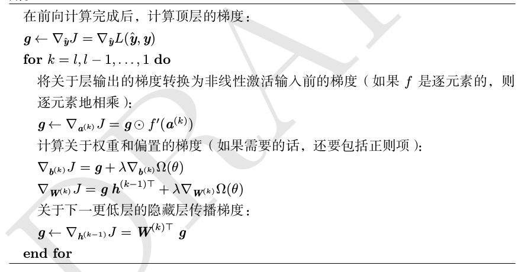
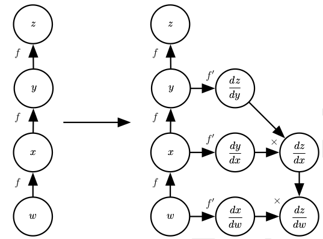
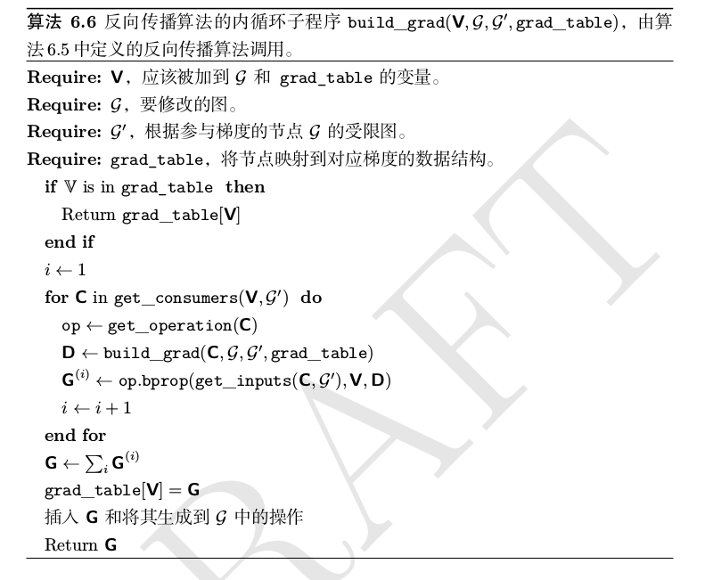

## 一、反向传播算法

### 1.1 局部梯度计算

对于计算图，有多中表示方法，这里节点表示变量，边表示操作。在前向传播的时候，图的节点以拓扑排序的顺序进行计算。在计算梯度的时候，我们反向传播计算的梯度，为了执行反向传播算法，我们可以构造一个在原计算图 G 添加一组额外节点的新的计算图。这形成了一个新的子图 B ，其中每一个节点都是 G 的节点。B 的计算顺序与 G 中相反，而且每个节点计算导数$\frac{\partial u^{(n)}}{\partial u^{(i)}}$都与前向图中的节点$u^{(i)}$相关联。

反向计算的时候，每个节点要执行一次内积，内积的二者分别是局部梯度和传到该节点的已经计算好的误差信号。总而言之，计算量与 G 中的边成正比。所以，我们通过反向传播的策略避免了多次计算链式法则中的相同子表达式，避免了简单的操作却具有指数时间复杂度的后果。在具有 n 个节点的图中计算梯度,将永远不会执行超过$O(n^2)$个操作,或者存储超过$O(n^2)$个操作的输出。（这里我们是对计算图中的操作进行计数,而不是由底层执行的操作个数,所以重要的是要记住每个操作的运行时间可能是高度可变的。）

<!-- more -->

整个算法的数据结构是数值表、梯度表、图结构，数值表存储计算节点的输出值，另一个表存储计算最终节点对当前节点的梯度（假设只有一个计算图标量输出）。计算过程按照拓扑顺序，提取该节点的父节点，从数值表中读取数值并计算，然后存入数值表的对应位置。反向传播同理，不过反向传播的节点的操作类型是自动得到的，根据正向传播的操作的梯度得到，每一个操作需要计算一个梯度与一个点乘。

因此，我们可以将反向传播算法看做是一种表填充算法。通过按顺序的填充表，避免了重复计算许多公共的子表达式，这种策略本质上可以理解为一种**动态规划**。

一个简单的MLP的反向传播算法：

### 1.2 符号表示

代数表达式和计算图都对符号(symbol)或不具有特定值的变量进行操作。这些代数或者基于图的表达式被称为**符号表示**(symbolic representation)。当我们实际使用或者训练神经网络时,我们必须给这些符号赋特定的值。
一些反向传播的方法采用计算图和一组用于图的输入的数值,然后返回在这些输入值处梯度的一组数值。我们将这种方法称为**符号到数值**的微分。这种方法用在诸如 Torch (Collobert et al., 2011b) 和 Caffe (Jia, 2013) 之类的库中。
另一种方法是采用计算图以及添加一些额外的节点到计算图中,这些额外的节点提供了我们所需导数的符号描述。这是 Theano 和 TensorFlow 所采用的方法。这种方法的主要优点是导数可以使用与原始表达式相同的语言来描述。因为导数只是另外一张计算图,我们可以再次运行反向传播,对导数再进行求导就能得到更高阶的导数。
我们将使用后一种方法描述反向传播算法。图的任意子集之后都可以使用特定的数值来求值。这允许我们避免精确地指明每个操作应该在何时计算。相反,通用的图计算引擎只要当一个节点的父节点的值都可用时就可以进行求值。如下图。

上图是使用符号到符号的方法计算导数的示例。在这种方法中,反向传播算法不需要访问任何实际的特定数值。相反,它将节点添加到计算图中来描述如何计算这些导数。通用计算图自动微分求值引擎可以在随后计算任何特定数值的导数。

对于通用计算图引擎，一个节点通常需要提供这么几个方法：

- `get_operation(V)`: 根据 V 执行特定的计算，可以返回一个指向真正的计算函数的指针。
- `get_consumers(V, G)`: 返回图 G 中的 V 的子节点。
- `get_inputs(V, G)`: 返回图 G 中的 V 的父节点。
- `bprop(inputs, Grad, X)`: X是表示计算谁的梯度，inputs是本次计算的输入，即f'(x)中的 x。Grad的回传到该节点的误差信号。

反向传播算法的软件实现通常提供操作和其`bprop`方法,所以深度学习软件库的用户能够对使用诸如矩阵乘法、指数运算、对数运算等等常用操作构建的图进行反向传播。构建反向传播新实现的软件工程师或者需要向现有库添加自己的操作的高级用户通常必须手动为新操作推导`op.bprop`方法。

基于此，我们可以重新表达MLP的反向传播算法：

### 1.3 自动微分

深度学习界在某种程度上已经与更广泛的计算机科学界隔离开来,并且在很大程度上发展了自己关于如何进行微分的文化态度。更一般地, **自动微分**(automatic differentiation)领域关心如何以算法方式计算导数。这里描述的反向传播算法只是自动微分的一种方法。它是一种称为**反向模式累加**(reverse mode accumulation)的更广泛类型的技术的特殊情况。其他方法以不同的顺序来计算链式法则的子表达式。一般来说,确定一种计算的顺序使得计算开销最小,是困难的问题。

找到计算梯度的最优操作序列是 NP 完全问题 (Naumann, 2008)。举例来说，我们知道$CE(Softmax(\theta), y)$对于$\theta$的导数有非常简单的形式，或者sigmoid函数的导数也可以利用已经计算好的函数值快速计算，但是单纯的根据这些函数的形式通过基础算术运算构建反向传播的话就会十分笨重。如果找到计算图中的边的最优的简化形式是NP问题。TensorFlow 的实现使用基于匹配已知简化模式的试探法,以便重复地尝试去简化图。

在机器学习以外的许多社区中,更常见的是使用传统的编程语言来直接实现微分软件,例如用 Python 或者 C 来编程,并且自动生成使用这些语言编写的不同函数的程序。在深度学习界中,计算图通常使用由专用库创建的明确的数据结构表示。

专用方法的缺点是需要库开发人员为每个操作定义 bprop 方法,并且限制了库的用户仅使用定义好的那些操作。然而,专用方法也允许定制每个操作的反向传播规则,允许开发者以非显而易见的方式提高速度或稳定性,对于这种方式自动的过程可能不能复制。

因此,反向传播不是计算梯度的唯一方式或最佳方式,但它是一个非常实用的
方法,继续为深度学习社区服务。在未来,深度网络的微分技术可能会提高,因为
深度学习的从业者更加懂得了更广泛的自动微分领域的进步。

### 1.4 高阶微分

## 二、TensorFlow

### 2.1 基本要点

图中有三种节点：Variable，placeholder以及operation，注意Variable其实也是operation节点。比如我们运行`h = tf.nn.relu(tf.matmul(x, W)+b)`，其实h是一个operation，是一种符号表示，没有值，并且需要在session中运行才可以得到真实值。并且在这一行代码中，tensorflow实际在背后创造了很多匿名节点。使用图的好处在于：
1. 节省计算，只计算真正需要的节点。
2. 将计算图拆分为小的计算步骤，并通过局部梯度与误差信号来执行自动微分。
3. 可以跨硬件的运用分布式计算的优势

`constrant`类型的节点不可训练，另外值是存储在`Graph`中而不是`session`中的，可以使用`sess.graph.as_graph_def()`查看`graph`的结构（是xml格式的数据），可以在其中发现`constant`节点的内容，这使得加载或保存计算图的代价会变大。因此最佳实践是只是用`constant`来保存基本类型，使用`Variable`或者`reader`来保存较大的数据，以节省内存。对于`Variable`，最佳实践是使用`get_variable`来读取或创建变量。

所有的变量都需要显式的初始化，使用特定的`variables_initializer(v)`或`v.initializer`来初始化特定的变量 v ，或者使用`tf.global_variables_initializer()`来初始化全部变量。初始，`initializer`是一个辅助`operation`节点（这可以在tensorboard中看到），所以需要通过`session.run`来显式执行。

将placeholder的shape=None，使得我们很容易构造计算图，当有不同的批处理大小时非常灵活，但是对于调试来说简直就是噩梦。而且还会影响后续的shape inference。在实践中可以在真实运行之前先输入小的测试数据检测计算图是否可以运行无误。

session绑定了特定的执行的上下文。可以理解为session是对计算图的硬件支持，包括cpu、gpu的部署，内存分配与变量的封装。执行方式是`sess.run(fetches, feeds)`，其中，fetches是一个list，列表中的元素表示希望本次session运行返回哪些节点的输出，feeds是一个dict，用于对图中的节点赋予具体的值。在session内“evaluate the graph to fetch the value of a”。session会根据run的参数，也就是希望返回的operation的结果，去计算真正需要的operation节点，也就是说真正运行的是我们创建的图的一个子图。session还会考虑手头的计算资源并划分计算任务，即图的划分与分布式计算等等。

截至到这里的session运行只是运行一遍前向传播操作。如果需要对指定函数进行优化，就需要创建一个`Optimizer`对象，该对象执行`minimize`函数形成一个新的`operation`节点，该操作会对所有相关的`Variable`求目标的梯度并进行更新一次。

使用`variable_scope`重用变量，用`name_scope`组织变量，也可以在tensorboard中创建更好看的计算图。variable scope会隐式的创建一个name scope。

`Optimizer`会在计算图中创建出辅助节点，然后session会对所有`Optimizer`依赖的`trainable`的变量计算梯度并进行更新。至于变量是否可训练，该属性可以在创建`Variable`的时候用`trainable`布尔属性指定。

### 3.2 实践Tips

用 tensorflow 去学习 NLP 时我们都会学习用tensorflow去做一个 word2vec 模型。在该模型中，有几点需要说明一下，首先就是词向量实际上是one-hot向量与一个大的矩阵相乘，这个操作实际上会被称为`lookup`，在 tf 中对此有`embedding lookup`层提升性能。其二，我们在学习的时候学的损失函数是Negative Sampling，该损失时NCE的简化版本，在实际训练的时候，我们可以用tf为我们提供的`nec_loss`层，NCE理论上提供与softmax近似的效果保证，Negative Sampling却不可以。
